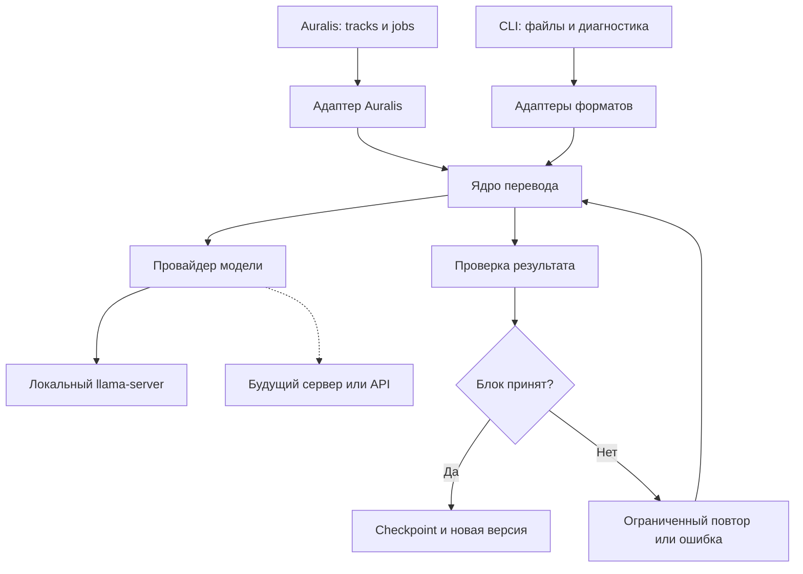
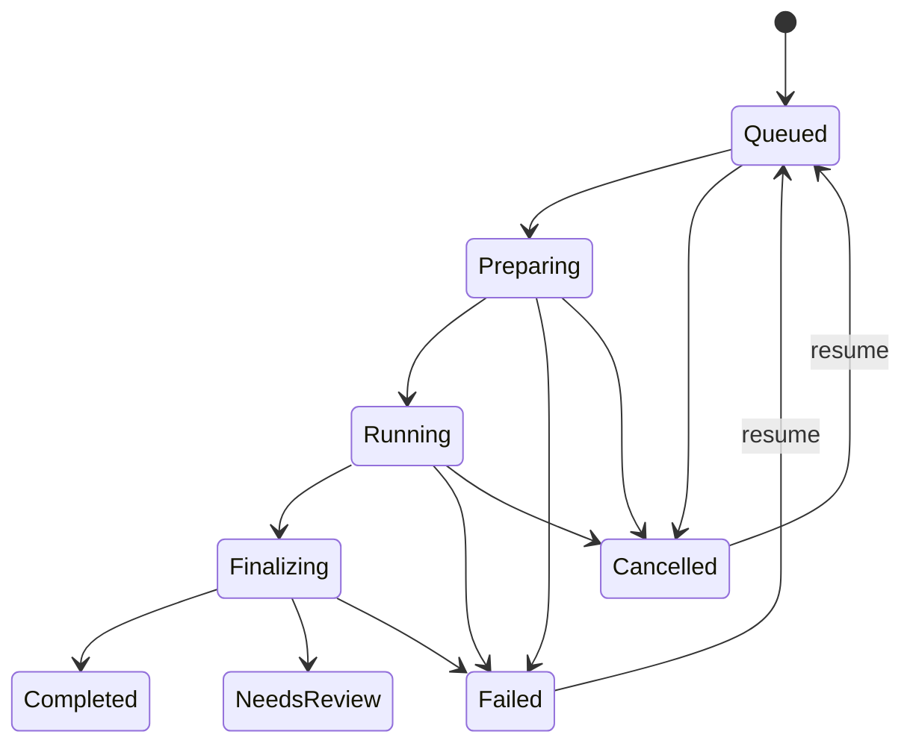

# Auralis: план отдельного модуля перевода
Версия плана: 2.0 · 23 сентября 2026 года  
Предлагаемый репозиторий: `auralis-translate`  
Предлагаемая ветка начала работ: `feat/translation-module`

**Статус:** историческая версия плана на русском языке. Текущий англоязычный [план продукта](docs/PRODUCT_PLAN.md) и [архитектурная документация](docs/README.md) содержат согласованные решения для первого выпуска.

**Уточнения MVP от 24.09.2026:** [документация в `docs/`](docs/README.md) фиксирует согласованные после этого плана решения: готовый файл субтитров на входе, неизменный оригинал и отдельный выход, собственная SQLite Translate, постоянная связь с проектом Auralis и вложенный Git submodule. В этих вопросах документы `docs/` уточняют или заменяют прежние допущения плана; остальная исследовательская часть и release gates сохраняются.

**Рекомендация:** независимый Rust-модуль перевода с CLI, адаптерами форматов и подключаемым движком. Первый кандидат — специализированная небольшая модель `tencent/Hy-MT2-1.8B`, локально через закреплённую сборку `llama-server`. Модель переводит текст; программа сохраняет структуру, время и служебные данные. Результат — новая русская дорожка и, при файловом вводе, файл того же поддержанного формата.

Это проектный план, а не отчёт о готовой реализации. В рамках подготовки изучен предыдущий план от 22.09.2026 и проверены первичные источники моделей, runtime и форматов. Модели не запускались, скорость и качество не измерялись, новый удалённый репозиторий не создавался. Примеры перевода ниже составлены вручную для иллюстрации контрактов.

## 1. Цель и исходные допущения

Нужно переводить готовый китайский или японский текст на русский независимо от его происхождения: пользовательский файл, дорожка YouTube, результат распознавания речи, текстовые сегменты речевого конвейера.

Требование «всё в изначальном формате, только текст на русском» превращается в проверяемый контракт:

- исходник остаётся неизменным;
- для субтитров сохраняются число и порядок реплик, их идентичность, начало и конец;
- формат файла, поддержанные настройки и разметка сохраняются;
- заменяется только текст, разрешённый адаптером формата;
- неподдержанные конструкции обнаруживаются до перевода;
- неполный или повреждённый результат не объявляется готовым переводом.

Для этой задачи подходит компактная специализированная модель перевода, которая хорошо работает с выбранными языковыми парами при доступных ресурсах. Обучать свою модель с нуля для первой версии не нужно.

| Решение | Рабочее допущение |
| --- | --- |
| Размещение | Локальный desktop; серверный адаптер возможен позже |
| Режим | Пакетная обработка уже готовой дорожки |
| Языки | В контракте сразу `zh`, `zh-Hans`, `zh-Hant`, `ja` → `ru` |
| Выпуск | Сначала проверенный китайский профиль; японский включается после собственного языкового gate |
| Целевой язык | В продукте фиксирован `ru` |
| Результат | Отдельная русская версия, исходная дорожка доступна |
| Облако | Не требуется базовому сценарию; только явно выбранный режим |
| Оборудование | Неизвестно; конфигурацию стенда и SLA фиксируем на этапе 00 |
| ОС | Выбираем одну ОС первого релиза на этапе 00; остальные проходят свою проверку |

Если Auralis должен работать на сервере или в реальном времени, ядро остаётся полезным, но поставка, очередь и требования к задержке меняются. Это не следует незаметно смешивать с desktop MVP.

## 2. Что известно об Auralis

Предыдущий план ссылается на сохранённый аудит Auralis от 10.09.2026, commit `f2f5cc84de3241ff3828a0e3e1877c2470a93b82`: Tauri, React/TypeScript, Rust workspace, application/ports/adapters, jobs, SQLite, artifacts и outbox.

В этой работе текущий исходный код и HEAD Auralis не проверены. Это историческое основание выбора Rust и способа интеграции, а не подтверждение наличия конкретных сегодняшних классов. Упомянутые ниже имена портов и DTO — проектируемые контракты.

На этапе 00 нужно найти в актуальном Auralis:

1. Владельца subtitle/text tracks и их revision.
2. Application API создания фоновых jobs, отмены и восстановления.
3. Реальный менеджер моделей и дочерних процессов.
4. Механизм записи artifacts и публикации новой версии.
5. Существующий импорт SRT/VTT и captions YouTube.
6. Правила репозитория, архитектурные ограничения и CI.

Интеграционный адаптер должен использовать эти механизмы. Новые параллельные базы проектов и очереди внутри переводчика не вводятся.

## 3. Место перевода в речевом конвейере

| Что поступает | Как обрабатывается |
| --- | --- |
| Готовый SRT/VTT | Разбор → перевод текстов → восстановление исходного формата |
| Уже разобранная дорожка Auralis | Передача структурированных реплик напрямую |
| Субтитры YouTube | Source-specific импорт в Auralis → готовая дорожка → перевод |
| Аудио без текста | ASR/STT в отдельном модуле → сегменты → перевод |
| Текст, который затем озвучит TTS | Перевод → отдельный TTS-модуль |
| Текстовые сегменты существующего TTS-конвейера | Прямой перевод текста; повторное распознавание синтезированного аудио не требуется |
| Текст без времени | Перевод сегментов с сохранением ID; время не придумывается |

ASR/STT превращает речь в текст, TTS — текст в речь. Поэтому модуль перевода получает текст. Перевод аудио, синтез голоса и подгонка длительности озвучки находятся за его границей.

Длительность русской озвучки может отличаться от длительности оригинала. Готовый русский текст с прежними таймкодами не является обещанием синхронного дубляжа.

## 4. Архитектура и способ подключения



Выбранная форма модуля — **Rust-библиотека, подключённая в backend Auralis**. Вычисления модели выполняются отдельным дочерним процессом. CLI вызывает то же ядро и позволяет проверить перевод без запуска интерфейса Auralis.

| Вариант подключения | Решение |
| --- | --- |
| Rust crate в backend Auralis | Основной вариант: типизированный контракт, удобная отмена и прогресс |
| Дочерний `llama-server` | Основной runtime для локального inference; жизненным циклом управляет host |
| CLI как подпроцесс | Полезен для независимых клиентов; для Auralis с Rust backend избыточен как основной протокол |
| Отдельный HTTP-сервис перевода | Позднее, если перевод выполняется на общем сервере |
| Динамический Tauri-плагин | Не требуется для MVP; UI-facing оболочка не должна определять архитектуру ядра |
| Обязательная Python-среда у пользователя | Не вводится для выбранного desktop-профиля; допустима в исследовательском стенде |

Tauri поддерживает поставку external binaries [S8]. Точный способ запуска, остановки и упаковки согласовывается с текущим менеджером процессов Auralis.

**Путь зависимости:** UI → application/job layer Auralis → translation adapter → библиотека → provider → runtime. UI не вызывает inference напрямую.

При разработке допустима Cargo-зависимость на конкретный Git revision. В релизе закрепляются версия библиотеки, lockfile, runtime и модель. Не использовать плавающую `main`, ручное копирование исходников или submodule только ради подключения библиотеки.

## 5. Что хранить в отдельном репозитории

Предлагаемые имена и каталоги:

| Путь | Назначение |
| --- | --- |
| `Cargo.toml`, `Cargo.lock`, `rust-toolchain.toml` | Workspace и воспроизводимая сборка |
| `crates/auralis-translation/` | Контракты, блоки, контекст, глоссарий, orchestration, validation |
| `crates/auralis-translation-formats/` | Разбор, source map и экспорт файлов |
| `crates/auralis-translation-llamacpp/` | Provider и model-specific шаблоны для llama.cpp |
| `crates/auralis-translation-cli/` | Команды translate, inspect, doctor и resume |
| `models/manifests/` | Ревизии, checksum, лицензии, runtime compatibility, параметры |
| `schemas/` | Версионируемые JSON-контракты интеграции и CLI |
| `tests/fixtures/` | Маленькие структурные файлы, в том числе повреждённые |
| `eval/` | Методика, manifest корпуса, скрипты и отчёты измерений |
| `docs/adr/` | Решения по моделям, форматам и границам |
| `docs/integration.md` | Подключение Auralis и соответствие событий |
| `docs/format-support.md` | Проверенная матрица возможностей форматов |
| `docs/release-checklist.md` | Реальные release gates и ссылки на доказательства |

Четыре crate оправданы разными потребителями: ядро не зависит от форматов файлов и конкретного runtime. Внутри не создавать отдельный crate для каждого типа или helper.

Репозиторий Auralis содержит свой application adapter и UI перевода. Они не переезжают в переводчик. Веса модели, runtime-бинарники, скачанные видео и чужие полные субтитры не коммитятся в исходники. Для корпуса хранится manifest с происхождением и условиями использования; разрешённые fixtures можно версионировать.

## 6. Выбор модели

Первый эксперимент — прямой перевод китайский → русский с **Hy-MT2-1.8B**. Официальная карточка указывает поддержку китайского, японского и русского и приводит примеры контекста, терминологии и структурированных данных [S1]. Это основание включить модель в эксперимент, а не доказательство качества субтитров Auralis.

| Кандидат | Роль | Что проверяем |
| --- | --- | --- |
| `tencent/Hy-MT2-1.8B`, GGUF Q4_K_M | Первый компактный профиль | Смысл, формат ответа, имена, скорость и память |
| Та же модель, Q8_0; Q6_K при необходимости | Проверка влияния квантизации | Не объясняется ли ошибка сжатием весов |
| `tencent/Hy-MT2-7B` | Более крупный кандидат того же семейства [S4] | Насколько качество оправдывает дополнительные ресурсы |
| `google/translategemma-4b-it` | Независимый специализированный baseline | Качество прямых пар и ограничения шаблона |
| Одна небольшая универсальная LLM | Только при недостатках основных кандидатов | Улучшает ли сложный контекст без лишних добавлений |
| Облачный переводчик | Опциональное сравнение или будущий провайдер | Качество, задержка, стоимость и допустимость внешней обработки |

Официальные GGUF-файлы Hy-MT2-1.8B имеют размеры: Q4_K_M — **1,13 GB**, Q6_K — **1,47 GB**, Q8_0 — **1,91 GB** [S2]. Это размер весов на диске, а не полное потребление RAM/VRAM.

В LICENSE официального 1.8B GGUF указана Apache 2.0 [S3]. Для любой выбранной поставки сохраняются именно её лицензия, revision и уведомления. Нельзя автоматически переносить условия одной модели на другое поколение, конверсию или runtime.

У TranslateGemma свой шаблон сообщений и описанный входной контекст 2K токенов; условия доступа и использования отличаются от Apache-поставки [S5]. Общий prompt с произвольным JSON и соседними репликами не считается поддержанным способом без отдельного эксперимента.

**Порядок решения:**

1. Проверить 1.8B Q4 и Q8 на одинаковом корпусе.
2. Проверить 7B и TranslateGemma на тех же материалах с их корректными шаблонами.
3. Сопоставить качество, RAM/VRAM, время, число повторов.
4. Выбрать самый лёгкий профиль, проходящий gates.
5. Если никто не проходит — разбирать ошибки контекста, импорта и сегментации; затем менять модель или режим размещения.

Рейтинги авторов и наличие языков в карточке не заменяют проверку прямых пар `zh → ru` и `ja → ru`. Промежуточный перевод через английский не используется по умолчанию.

MVP не зависит от экспериментальной сверхнизкой квантизации. Сначала закрепляется обычный проверенный GGUF-профиль. Автоматическое дообучение и постоянно включённая вторая модель-критик в первую версию не входят.

## 7. Runtime и ресурсы

`llama-server` выбран как отдельный локальный процесс: документация описывает CPU/GPU inference, HTTP API и ограничение JSON-выхода схемой [S6]. Поддержка этих механизмов в runtime не доказывает совместимость любого шаблона любой модели.

Для production проверяется комбинация:

- конкретная модель, revision и SHA-256 весов;
- quantization;
- commit/build runtime и backend;
- tokenizer и chat template;
- размер контекста;
- способ форматирования ответа;
- decoding settings и stop conditions;
- ОС и аппаратный профиль.

Начальная эксплуатационная политика: один загруженный экземпляр выбранной модели, одна активная генерация, ограниченная очередь. Несколько блоков не должны одновременно загружать отдельные копии весов.

Host Auralis владеет ресурсным лимитом ASR/перевод/TTS. В MVP тяжёлые стадии выполняются последовательно, если совместное размещение не измерено. Модель выгружается по завершении или после idle timeout.

| Стенд | Назначение |
| --- | --- |
| CPU, 16 GB RAM | Первое измерение компактного профиля без обещания минимальных требований |
| GPU с 6–8 GB VRAM | Первый стенд ускоренного 1.8B-профиля |
| Отдельный стенд для 7B | Сравнение ресурсов и скорости при реально доступной памяти |

Это ориентиры для постановки эксперимента, не требования совместимости. Фактическая память включает веса, KV cache, буферы, runtime и само приложение.

Управляемый процесс запускается на loopback со служебной аутентификацией; readiness проверяется до выдачи задачи. API key и health endpoint описаны в runtime [S6]. Секрет передаётся доступным безопасным способом, не попадает в логи; пользовательский UI его не хранит.

Не включать серверные tools, agent mode, доступ к произвольным файлам и публичный listener ради перевода. Модель получает текстовые данные и не выполняет команды.

## 8. Контракты: две разные границы

Нужны два API, поскольку «перевести текстовые сегменты» и «вернуть исходный файл» — разные обязанности.

| API | Вход | Выход |
| --- | --- | --- |
| `translate_track` | Версионируемая текстовая/субтитровая дорожка | Переводы по ID, статусы, диагностика и provenance |
| `translate_document` | Исходные байты, формат, кодировка, политика | Новый файл того же поддержанного формата и отчёт |

`translate_document` использует `translate_track`. Обратной зависимости нет.

Если Auralis передал только нормализованный JSON, восстановить побайтовое оформление когда-то существовавшего SRT невозможно. Для точного экспорта нужен сохранённый исходный документ и source map. Это явное требование к интеграции.

### 8.1. TrackRequest

| Поле | Правило |
| --- | --- |
| `schema_version` | Версия внешнего контракта |
| `track_id`, `source_revision` | Идентичность и неизменяемая версия исходника |
| `kind` | `subtitles` или `text` |
| `source_language` | Явный язык; автоопределение только предлагает его |
| `target_language` | Только `ru` в текущем продукте |
| `source_kind` | uploaded, youtube_manual, youtube_auto, asr, text |
| `segments[].id` | Уникальный внутренний ID, не обязательно номер из файла |
| `segments[].text` | Исходный текст, без потери оригинала |
| `segments[].timing` | Обязателен для subtitles, отсутствует для text |
| `speaker_id` | Только известные данные, без выдуманной идентификации |
| `glossary_revision`, `glossary` | Подтверждённая терминология |
| `context` | Краткие подтверждённые сведения о сцене/жанре |
| `profile_id` | Закреплённый model/prompt/decoding профиль |
| `policy` | Правила структуры, переноса строк и проверки |

Для текущих SRT/VTT — целые миллисекунды, `0 <= start_ms < end_ms`. При будущих форматах с более точным временем нужен lossless timebase; округлять время ради общей модели нельзя. Порядок сохраняется; допустимые перекрытия не запрещаются как класс. Нарушение требований конкретного формата — отдельная ошибка импорта.

Пример проектируемого входа:

```json
{
  "schema_version": 1,
  "track_id": "track-17",
  "source_revision": "rev-7",
  "kind": "subtitles",
  "source_language": "zh-Hans",
  "target_language": "ru",
  "source_kind": "uploaded",
  "segments": [
    {
      "id": "c001",
      "timing": {"start_ms": 1200, "end_ms": 2800},
      "text": "你准备好了吗？"
    },
    {
      "id": "c002",
      "timing": {"start_ms": 2900, "end_ms": 4300},
      "text": "我们现在出发。"
    }
  ],
  "glossary_revision": "g0",
  "glossary": [],
  "profile_id": "local-default-v1",
  "policy": {
    "cue_mapping": "one_to_one",
    "layout": "preserve",
    "target_language": "ru"
  }
}
```

Нельзя вводить фиктивные нулевые таймкоды для text-only ввода. Также нельзя требовать времени от текста, который пока только готовится для TTS.

### 8.2. Ответ модели

Модель получает целевые тексты с минимальными ID, соседний контекст и термины. Файловые пути, исходные строки таймкодов и весь контейнер ей не нужны.

Желаемый ответ для провайдера с поддержкой структурированного batch:

```json
{
  "translations": [
    {"id": "c001", "text": "Ты готов?"},
    {"id": "c002", "text": "Мы сейчас выезжаем."}
  ]
}
```

Provider не обязан просить JSON у модели, которая плохо с ним работает. Он может перевести одну целевую реплику по штатному шаблону и прикрепить ID программно. Но нельзя считать, что такой fallback автоматически поддерживает соседний контекст: эта возможность отдельно объявляется и проверяется.

Runtime grammar уменьшает риск нарушения структуры. Ядро независимо проверяет ответ: точный набор ID, отсутствие дублей, типы, длины, placeholders и завершённость. Корректный JSON не доказывает смысловую точность.

### 8.3. Результат библиотеки

`TrackResult` содержит:

- исходные `track_id` и `source_revision`;
- перевод по каждому исходному ID и итоговый статус;
- отдельные `warnings` и `errors`, привязанные к сегментам/блокам;
- точные model/runtime/prompt/glossary fingerprints;
- число попыток и измеренную длительность;
- признак completeness и потребности в проверке.

Таймкоды присоединяет код из зафиксированной версии исходника. Отсутствующий перевод не заменяется китайским текстом под статусом «готово».

Не возвращать придуманную моделью «уверенность 97%». Полезнее наблюдаемые признаки: `truncated_output`, `glossary_mismatch`, `reading_speed_exceeded`, `source_alignment_review`.

## 9. Как действительно сохранить исходный формат

Основной режим — `preserve`: сохранять контейнер и разрешённую структуру, заменяя только объявленные текстовые участки.

Для файлового адаптера нужны:

1. **Исходные байты** и явная информация о кодировке, BOM, концах строк.
2. **Представление структуры с исходными диапазонами**: concrete syntax tree или эквивалентный source map.
3. **Переводимые участки**: текстовые узлы с устойчивыми ID и картой к cues.
4. **Защищённые участки**: времена, настройки, поддержанные теги, заголовки и служебные секции.
5. **Renderer патчей**: вставляет только проверенный текст, сохраняя остальные исходные байты.
6. **Повторный разбор выхода** и сравнение структурных инвариантов.

Одного AST, который затем сериализуется заново, недостаточно для обещания сохранения пробелов, порядка полей и оформления.

Для поддержанного strict-профиля проверяются отдельно:

- совпадение байтов неизменяемых диапазонов;
- совпадение семантической структуры и времён;
- допустимость переводимого payload;
- соответствие каждого перевода исходному сегменту.

Расширение диапазонов при более длинном русском тексте ожидаемо. Сравнивать надо защищённые фрагменты по source map, а не по прежним абсолютным смещениям.

### 9.1. Переносы строк и визуальное оформление

Две политики, выбираемые явно:

| Политика | Поведение |
| --- | --- |
| `preserve`, по умолчанию | Сохраняет число логических строк внутри cue и типы их разделителей; распределение русского текста проверяется |
| `reflow_text` | Разрешает новые переносы внутри того же cue; ID, время и формат не меняются |

В `preserve` нельзя гарантировать, что новая русская фраза будет той же ширины. Если текст не помещается естественно, выдаётся предупреждение. Недопустимо обрезать слова или самовольно переключать политику.

Для одной строки возврат модели с лишними строками не принимается как готовый strict-результат. Для нескольких строк можно проверять формат с защищёнными разделителями или переводимыми text-slot ID, предоставляя весь cue как контекст. Это ограничение формата проверяется и языковым benchmark.

### 9.2. Кодировки

Стартовая гарантированная область — валидный UTF-8 с сохранением BOM и LF/CRLF. Для иных кодировок нужен явный decoder и тест round trip.

GBK, Shift-JIS и другие кодировки могут не представить русский текст. Сохранение такой кодировки и перевод на русский иногда несовместимы. Возвращать понятную ошибку и предложить явный экспорт UTF-8. Автоматическая конверсия не может называться режимом «изменён только текст, байты остального сохранены».

### 9.3. Разметка и защищённые токены

Теги извлекаются парсером, а не общим regex. Для модели используются уникальные внутренние placeholders, которые не пересекаются с исходным текстом. Проверяются их полный набор, кратность, порядок/вложенность согласно формату; затем код восстанавливает оригинальную разметку.

Порядок произвольных inline styles нельзя механически навязать переводу без проверки смысла. Для MVP гарантировать plain text и простые обёртки всего cue. Частичное выделение отдельных слов и сложные вложенные spans — отдельная проверенная возможность, иначе `UNSUPPORTED_FEATURE`.

Служебные language annotations вроде `<lang zh>` после перевода могут стать неверными. В strict-профиле такие конструкции требуют отдельной поддержки или отклоняются. В режиме конвертации изменение на `ru` отражается в отчёте. Язык новой дорожки Auralis всегда записывается как `ru`.

Текст модели проходит format-aware encoding. Он не может создать новый cue, внедрить тег или закончить блок пустой строкой. Для WebVTT специальные символы экранируются корректно; для конструкций без безопасного представления возвращается ошибка либо применяется явно выбранная текстовая политика.

## 10. Матрица поддержки форматов

WebVTT содержит не только текст и внешние времена, но и settings, текстовую разметку и внутренние timestamp objects; разные cues могут перекрываться [S9]. ASS содержит управляющие теги, включая время слогов karaoke [S10]. Поэтому поддержка расширения файла не равна поддержке всех его конструкций.

| Вход | Первый выпуск | Сохранение и ограничения |
| --- | --- | --- |
| Каноническая subtitles-дорожка | Да | ID, порядок, внешние времена, поддержанные метаданные |
| Канонические text-сегменты | Да | ID и порядок, без синтетических времён |
| SRT, UTF-8, plain text | Да | Оформление блока, исходные номера, таймкоды, переводы строк |
| SRT, простые полные обёртки cue | При наличии fixtures и проверки | Не заявлять все HTML-подобные варианты одним пунктом |
| WebVTT, текстовые cues | Да, документированный subset | Header, идентификаторы, settings и разрешённые нетекстовые блоки сохраняются |
| WebVTT STYLE/REGION/NOTE | Сохранять непрозрачно, если разбор безопасен | Не переводить CSS и комментарии как диалог |
| WebVTT voice/class wrappers | После проверки адаптера | Не локализовать служебные идентификаторы говорящих |
| WebVTT inline timestamps, ruby, language spans | Не обещать в strict MVP | Отклонение либо отдельная явная конвертация |
| YouTube manual captions | Через проверенный импорт Auralis | Переводчик не скачивает видео и не выбирает дорожку |
| YouTube auto captions с rolling/word events | Через source-specific нормализацию | Сохраняется raw source и карта происхождения |
| ASS/SSA | Следующая версия | Отдельный lossless parser; перевод только текстовых частей Events |
| Произвольный пользовательский JSON | Только через описанную схему | Переводить явно заданные поля; не обходить все строки наугад |
| XML/TTML/YouTube JSON3 в исходном виде | Позднее, отдельные adapters | Не выдавать смену формата за сохранение исходного |

Номер/идентификатор из файла не обязательно уникален. Внутренние ID строятся независимо и связываются с порядком и source map; исходная нумерация сохраняется.

Для сложных файлов `inspect` до inference показывает неподдержанные возможности. Пользователь не должен ждать перевод всего фильма, чтобы узнать, что экспорт уничтожит стили.

Сохранённые шрифт и позиция ASS не гарантируют визуальную идентичность русской надписи: могут измениться длина и наличие кириллических glyphs. Смена шрифта или размера — явная операция адаптации, вне строгой замены текста.

## 11. YouTube, ASR и внутрисегментные тайминги

Переводчик не должен знать YouTube URL, cookies, способ загрузки или детали ASR-модели. Его вход — зафиксированный текстовый snapshot.

Auralis/source adapter отвечает за:

1. Выбор конкретной исходной дорожки и языка.
2. Фиксацию, ручная она или автоматическая.
3. Сохранение raw-файла отдельно от нормализованной дорожки.
4. Преобразование source-specific rolling events в подтверждённые стабильные cues.
5. Карту `source_event_ids → canonical_cue_ids` и версию нормализатора.
6. Передачу качества/неопределённости ASR без скрытого «исправления» смысла.

Повтор в соседних captions может быть реально произнесённым повтором. Общий fuzzy deduplication текста запрещён. Если нормализатор не умеет конкретную форму, файл не считается поддержанным импортом.

Перевод сохраняет внешние времена уже утверждённых cues. Если до перевода captions были нормализованы, нельзя заявлять побайтовое сохранение raw YouTube-файла: перевод сохраняет каноническую дорожку.

**Тайминги слов/слогов не переносятся по индексам.** Русский порядок слов, число слов и слогов отличаются. Для word timestamps, ruby и karaoke возможны только отдельные режимы:

- отказ strict-профиля;
- явное удаление/преобразование в обычные cues с отчётом;
- будущий этап выравнивания и новой временной разметки.

Будущие live/ASR hypotheses тоже отдельный контракт: устаревшая гипотеза не должна публиковать перевод поверх новой. В MVP принимаются только финализированные сегменты.

## 12. Конвейер перевода

### 12.1. Подготовка

1. Зафиксировать source revision, профиль, глоссарий и политику.
2. Проверить размер файла, кодировку, структуру и поддержанные возможности.
3. Отделить исходный документ от рабочей модели текста.
4. Выполнить мягкую нормализацию только рабочей копии; хранить mapping.
5. Построить план блоков и контекстных зависимостей.
6. Запросить ресурсный lease у host и подготовить runtime.

Не удалять междометия, повторения, короткие ответы и указания звуков как «шум». Не заменять традиционную письменность на упрощённую для всех входов. Язык определяется на достаточно длинном тексте с подтверждением; отдельная строка только из иероглифов может быть неоднозначна.

### 12.2. Контекст и блоки

Начальная гипотеза для измерений: 8–16 коротких целевых cues, плюс 2–4 соседних с каждой стороны как исходный контекст. Это не фиксированный размер production-блока.

Реальный планировщик учитывает:

- tokenizer конкретной модели;
- размер template и глоссария;
- ограничения контекста и резерв на выход;
- границы предложения, сцены и смену говорящего;
- завершённость фраз;
- политику переносов и чтения.

Контекстные cues помечены как read-only; они не входят в ожидаемый набор выходных ID. Блок не должен перескакивать через монтажную границу только ради заполнения лимита.

MVP использует соседний исходный текст и подтверждённый глоссарий. Предыдущие машинные переводы и постоянно обновляемое summary не включаются: они добавляют накопление ошибок и цепочки инвалидации. Их можно добавить позже с явными зависимостями.

### 12.3. Одна фраза в нескольких cues

Несколько cues могут составлять одно предложение. Модель получает их вместе, но возвращает отдельный перевод для каждого ID.

Сохранить соответствие «один cue → один cue» недостаточно: смысл может оказаться в неправильном времени. Например, отрицание или имя из второй реплики не должно произвольно переехать в первую и изменить восприятие сцены.

Для MVP сохраняется сетка cues; трудный фрагмент получает `source_alignment_review`. Контроль идёт по сцене с видео/аудио при оценке корпуса. Произвольное распределение слов общего перевода пропорционально длинам строк не применяется.

Будущий режим resegmentation хранит соответствие исходной группы новым cues, ограничения времени и отдельную revision. Он не включается автоматически при неудаче strict-перевода.

### 12.4. Инструкции модели

Prompt принадлежит провайдеру и проверенному профилю. Его смысл:

- перевести целевые сегменты на русский;
- использовать контекст для смысла, не переводить его отдельным выходом;
- сохранить факты, отрицания, числа, имена и тон;
- не добавлять объяснений или событий;
- соблюдать подтверждённые термины;
- сохранить защищённые placeholders и требуемую форму ответа.

Это смысловой контракт, не универсальный готовый prompt для всех моделей. Для каждого семейства проверяются штатный template, специальная токенизация, stop conditions и decoding.

Начинать сравнение с параметров, рекомендуемых авторами, и одного заранее заданного альтернативного режима. Не считать `temperature=0` гарантией качества или побитовой воспроизводимости. Все фактически использованные параметры записываются.

### 12.5. Глоссарий

`GlossaryEntry` содержит исходный термин, подтверждённый русский вариант, разрешённые формы, область действия и revision.

- Передавать только относящиеся к текущему контексту записи.
- Для имён учитывать утверждённую транслитерацию.
- Разрешать русские падежные формы.
- Не делать глобальную строковую подстановку после перевода.
- Не превращать автоматически найденное имя в подтверждённый канон.
- Конфликт глоссария выявлять до inference.

Для японского отдельно проверяются обращения, опущенные местоимения и неоднозначные чтения имён. Для китайского — имена, традиционная письменность, короткие продолжения и контекстуальные связи.

### 12.6. Читаемость

Предлагаемый начальный профиль диагностики: до двух строк, ориентир 42 видимых знака в строке и 20 видимых знаков в секунду. Это настраиваемые продуктовые цели, не универсальный стандарт.

Считать видимые Unicode grapheme clusters без markup. Для text-only сегментов скорость чтения по времени не вычисляется.

В режиме `preserve` превышение даёт предупреждение; текст не обрезается. В `reflow_text` перенос внутри cue допустим по выбранной политике. Сокращение перевода, смена смысла и изменение времени не считаются переносом строк.


## 13. Проверка результата и обработка ошибок

Проверка выполняется **до checkpoint и до публикации**. Используются три независимых уровня.

| Уровень | Что проверяется | Реакция |
| --- | --- | --- |
| Структурный | Schema, точный набор ID, отсутствие дублей, валидные text slots, placeholders, завершённость | Ошибка блокирует принятие блока |
| Языковой и предметный | Подозрительные пропуски, числа, отрицания, термины, неожиданный язык | Диагностика; тяжёлые случаи требуют проверки |
| Субтитровый | Читаемость, сетка cues, расположение смысла, корректность экспорта | Предупреждение или блокировка согласно конкретному нарушению |

Детерминированно гарантировать можно формат и инварианты. Верность перевода всех произвольных фраз не доказывается автоматическим validator.

Проверка языка не должна запрещать все латинские символы: имена, бренды, URL и код могут остаться латиницей. Короткие ответы вроде «Да» и числа также нельзя оценивать теми же порогами language detection, что длинный абзац.

Числа проверяются с учётом локализации записи. Простое неравенство строк «1,000» и «1000» не доказывает смысловую ошибку. Проверки отрицаний и выравнивания являются сигналами риска; модель-критик не превращает их в строгую гарантию.

### 13.1. Ограниченные повторы

Начальная политика для эксперимента:

1. Основная попытка.
2. Один повтор с конкретной причиной отказа validator.
3. Если проблема связана с длиной/структурой большого batch, однократное разбиение на два меньших блока.
4. На исходный блок не более четырёх model calls суммарно; network retries входят в тот же бюджет.
5. Дополнительно ограничены общее время и число токенов job.

Для одного cue дальнейшее разбиение не применяется. После исчерпания бюджета — явная ошибка или review-статус. Числа настраиваются после измерений, а не увеличиваются бесконечно ради зелёного результата.

OOM из-за KV cache иногда позволяет уменьшить блок/контекст. OOM из-за самих весов этим не исправляется. При смене модели или профиля создаётся новый идентифицируемый запуск; уже принятые результаты не получают задним числом чужую provenance.

Сбой локальной модели не включает облако и не отправляет туда текст автоматически.

### 13.2. Каталог ошибок

| Код | Значение | Действие |
| --- | --- | --- |
| `UNSUPPORTED_LANGUAGE` | Направление не включено в проверенном профиле | Выбрать поддержанный язык/профиль |
| `UNSUPPORTED_FORMAT` | Неизвестный формат | Использовать поддержанный adapter |
| `UNSUPPORTED_FEATURE` | Например, неподдержанные karaoke/ruby | Остановить strict-ввод до inference |
| `INVALID_SOURCE` | Повреждённая структура/тайминги | Исправить источник |
| `ENCODING_NOT_REPRESENTABLE` | Русский не помещается в выбранную кодировку | Явно экспортировать UTF-8 |
| `MODEL_MISSING`, `MODEL_HASH_MISMATCH` | Нет весов или нарушена целостность | Загрузить/восстановить модель |
| `RUNTIME_INCOMPATIBLE` | Непроверенная или неподходящая комбинация | Использовать совместимую поставку |
| `CONTEXT_OVERFLOW` | Запрос не помещается | Перепланировать с ограниченным бюджетом |
| `OUT_OF_MEMORY` | Недостаточно RAM/VRAM | Применить допустимый профиль либо завершить с ошибкой |
| `INVALID_MODEL_OUTPUT`, `TRUNCATED_OUTPUT` | Непринимаемый ответ | Ограниченный повтор |
| `TIMEOUT`, `RUNTIME_EXITED` | Inference не завершён | Повтор/ошибка в пределах политики |
| `SOURCE_REVISION_CONFLICT` | Исходник изменился | Не применять устаревший результат |
| `USER_EDIT_CONFLICT` | Пользователь уже исправил перевод | Сохранить оба варианта, не затирать правку |
| `PERSISTENCE_FAILED`, `EXPORT_FAILED` | Ошибка checkpoint/финального файла | Не объявлять job завершённым |
| `CANCELLED` | Пользователь остановил job | Сохранить подтверждённые блоки |

Для будущего API-провайдера отдельно добавляются quota/auth/budget errors. Формат диагностик общий, но облачная эксплуатация не усложняет локальную реализацию заранее.

## 14. Jobs, checkpoint, resume и ручные правки

Долговечность обеспечивает host. В Auralis это существующие jobs/storage; в CLI — локальный manifest и результаты блоков. Библиотека не заводит свою базу пользовательских проектов.

Логические стадии, которые нужно сопоставить текущей state machine Auralis:



`NeedsReview` означает, что результат существует, но проверка требует внимания. Техническая полнота и языковая проверенность — отдельные признаки. UI может показать «переведено 100%, требуется проверка», не называя результат безусловно готовым.

### 14.1. Фиксация блока

Порядок:

1. Библиотека получает ответ.
2. Validator принимает структуру и прикладывает диагностику.
3. Host идемпотентно сохраняет результат вместе с fingerprint.
4. Host подтверждает durable checkpoint.
5. Только после этого увеличивается счётчик сохранённых cues.

Токены streaming-ответа не являются сохранённым прогрессом. Если интерфейс показывает черновой текст, он явно помечен и не публикуется в итоговую дорожку.

Сохранение одного блока учитывает состояние job и revision. Повторная доставка события после crash не дублирует перевод. Model calls могут выполниться повторно; обещание exactly-once для inference не требуется. Идемпотентным должно быть принятие результата.

### 14.2. Отмена и восстановление

Отмена прекращает планирование новых блоков и отменяет текущий запрос. После ограниченного grace period можно завершить только принадлежащий host процесс, если он не обслуживает другие задания. Чужой/общий runtime убивать нельзя.

Resume использует только подтверждённые checkpoint. Неполный ответ модели отбрасывается; он не считается успешно переведённой половиной блока.

Если запись checkpoint не удалась, статус «успех» не отправляется. Уже сохранённые блоки остаются пригодными для resume после восстановления storage.

### 14.3. Source revision и пользовательские изменения

- Результат привязан к зафиксированной версии исходной дорожки.
- Изменение source revision запрещает автоматическую публикацию старого job поверх новой.
- Ручная правка русского текста имеет свою revision и признак происхождения.
- Переводчик не перезаписывает её автоматически.
- Повтор выбранной реплики создаёт новый вариант; сравнение и применение происходят в Auralis.
- При правке исходника пересчитывается изменённый блок и блоки, которым этот текст фактически передавался как контекст.

Не обязательно заново переводить весь фильм: content-based кэш позволяет повторно использовать действительно неизменные запросы после создания нового job. Проверка revision при применении при этом остаётся обязательной.

### 14.4. Финальная публикация

Новая русская дорожка публикуется через существующий механизм artifacts/transactions Auralis. Если он ещё не реализован, это отдельная зависимость интеграции.

Файл и запись БД обычно не являются одной атомарной операцией. Нужен принятый в host протокол: staging-файл → durable запись/checksum → ссылка/manifest в транзакции → финализация и восстановление после crash. Не объявлять произвольный rename плюс запись БД «атомарной транзакцией».

CLI пишет финальный файл через временный файл на том же filesystem и atomic replace только после полной проверки. Исходник по умолчанию не перезаписывается. При ошибке готовый файл не подменяется частично переведённым; checkpoint и отчёт остаются.

## 15. Кэш и воспроизводимость

Кэш переводов, журнал job и пользовательские правки — разные сущности.

Ключ результата включает все данные, влияющие на модель:

- целевой нормализованный текст с ID/text-slot mapping;
- фактически переданный соседний контекст;
- языки и подтверждённые сведения о сцене/говорящих;
- применённую часть глоссария и правила склонения;
- идентичность весов, revision и quantization;
- template/prompt/segmentation версии;
- decoding и формат ответа;
- параметры длительности/читаемости, если они передавались модели;
- runtime/backend профиль в принятой политике воспроизводимости.

Source revision хранится у job и checkpoint. Контентный ключ может не включать глобальную revision, чтобы допускать безопасное повторное использование неизменных блоков. Но он не отменяет проверку revision при публикации.

Кэш возвращает текстовые переводы, а renderer заново применяет их к текущему разрешённому source map. Нельзя использовать сохранённые абсолютные byte offsets другого документа.

Ключ только по исходной строке недостаточен: одинаковая фраза может иметь другой перевод в другой сцене. Seed и низкая temperature не гарантируют побайтовое совпадение на всех backend; точное повторное использование обеспечивает сохранённый принятый результат.

При появлении previous-translation context или rolling summary их версии включаются в зависимости. Тогда правка может инвалидировать последующие блоки; это стоимость такой функции, которую нужно явно принять.

## 16. Порты и события интеграции

Проектируемые границы ядра:

| Порт/тип | Ответственность |
| --- | --- |
| `TranslationProvider` | Перевести batch, вернуть typed output и статистику |
| `ProviderCapabilities` | Контекст, glossary, structured batch, limits, языковые профили |
| `TranslationEngine` | Планирование, orchestration, validation, ограниченные retries |
| `CheckpointStore` | Идемпотентная запись и загрузка подтверждённых блоков |
| `ProgressSink` | События с backpressure и ограниченными payload |
| `CancellationToken` | Остановка планирования и активного запроса |
| `RuntimeLease` | Право пользоваться уже подготовленным runtime/ресурсами |
| `FormatAdapter` | Inspect, parse, source map, render и structural diff |

Встроенный engine не должен неявно скачивать модель или запускать произвольный процесс при обычном вызове `translate`. Подготовкой управляет host через явный шаг. CLI может собрать эти шаги для автономной работы.

Минимальный набор событий:

| Событие | Что означает для UI |
| --- | --- |
| `PreparingModel` | Подготовка runtime/весов, отдельно от процента перевода |
| `TranslationPlanned` | Известен план и число переводимых сегментов |
| `BlockStarted` | Блок выполняется, ещё не сохранён |
| `BlockCommitted` | Результат подтверждён storage |
| `Diagnostic` | Есть предупреждение/ошибка с ID сегментов |
| `Finalizing` | Проверка/сохранение итоговой дорожки |
| `Completed`, `NeedsReview`, `Failed`, `Cancelled` | Явное итоговое состояние |

Не публиковать каждое изменение одного токена как долговечное событие job. Полный текст не нужен в системных логах и telemetry; диагностика по умолчанию содержит ID, код проблемы и метрики.

## 17. Пользовательский сценарий Auralis

1. Пользователь выбирает имеющуюся исходную дорожку или импортирует файл.
2. Auralis показывает язык и обнаруженные ограничения формата.
3. Пользователь запускает «Перевести на русский»; при первом запуске доступна загрузка модели.
4. Job сообщает подготовку и прогресс перевода, позволяет отменить.
5. После завершения появляется отдельная русская дорожка.
6. Пользователь сравнивает исходную и русскую реплику, видит предупреждения, исправляет текст.
7. Можно повторить выбранный блок или экспортировать в поддержанный исходный формат.

Базовые настройки: профиль качества, исходный язык, глоссарий, политика переносов. Размер batch, temperature, kernel и JSON schema не нужны в обычном пользовательском потоке.

В результате сохраняются исходный файл/дорожка, русская revision, происхождение перевода, диагностика и связь с job. Пользовательские исправления — часть проекта Auralis.

Отдельный TTS-шаг получает финальный выбранный русский текст. Адаптация под длительность озвучки не переписывает незаметно уже утверждённый перевод субтитров.

## 18. CLI для разработки и независимого использования

Команды ниже — проектируемый интерфейс, они ещё не реализованы.

```bash
auralis-translate inspect --input episode.zh.srt
auralis-translate doctor --profile local-default-v1
auralis-translate translate --input episode.zh.srt --output episode.ru.srt --source-language zh-Hans --target-language ru --layout preserve
auralis-translate resume --job ./translation-job
```

Для JSON-интеграции поддержать отдельный явный input/output mode и JSONL progress без смешивания с переведённым файлом. Человекочитаемые сообщения идут в stderr, результат — в выбранный output.

CLI должен:

- заранее показать unsupported features;
- принимать путь к управляемому runtime/модели по manifest;
- сохранять run manifest, checkpoint и диагностический отчёт;
- корректно обрабатывать SIGINT/закрытие процесса;
- иметь стабильные exit codes: success, review-required, invalid input, runtime failure, cancelled;
- не перезаписывать существующий output без явного `--overwrite`;
- не менять исходник при неудаче.

CLI и Auralis используют одни и те же validators, prompt profiles и форматы. «В CLI работает, в приложении другая логика» — недопустимое расхождение.

## 19. Поставка моделей и обновления

Manifest релизного профиля хранит:

| Группа | Содержимое |
| --- | --- |
| Модель | Model ID, immutable revision, filename, размер, SHA-256 |
| Условия | License/NOTICE и происхождение выбранного файла |
| Runtime | Закреплённый build/commit, platform/backend, checksum |
| Формат запроса | Tokenizer/template/prompt version, capability profile |
| Генерация | Decoding settings, limits и stop conditions |
| Совместимость | Проверенные языки, ОС, аппаратные стенды и версия библиотеки |
| Доказательства | Ссылка на evaluation report и known limitations |

Production manifest не содержит placeholder checksums и ссылок на плавающую `main`.

Загрузка: проверка свободного места → временный файл → resume с проверкой идентичности удалённого объекта → checksum → атомарная установка. Незавершённые веса не видны как доступная модель.

Обновление создаёт новую версию профиля. Активный job остаётся на своей версии. Возврат к предыдущему профилю не требует отката пользовательских переводов.

Для MVP выбрать одну platform/backend поставку и fallback CPU только после отдельного smoke/benchmark. Не обещать поддержку Windows/Linux/macOS и всех GPU по факту наличия соответствующих опций у llama.cpp.

После первоначальной загрузки локальный профиль должен проходить smoke без сети. Если модель скачивается отдельно, это явно видно при первом запуске; установка Auralis не обязана содержать гигабайты весов.

## 20. Методика выбора и проверки качества

Нужен воспроизводимый эксперимент до окончательного выбора модели.

### 20.1. Корпус

Китайский первый набор: 20–30 сцен, около 500 cues. Японский — самостоятельный корпус сопоставимого масштаба на своём этапе.

В набор включить:

- диалоги, объяснения и повествование;
- имена, названия и повторяющиеся термины;
- разговорную речь, идиомы, короткие ответы и эмоциональный тон;
- отрицания, числа, единицы измерения, перечисления;
- предложение, разбитое между cues;
- несколько говорящих и перекрытия;
- китайскую традиционную и упрощённую письменность;
- ASR-ошибки и качественные manual subtitles;
- латиницу внутри исходного текста;
- сложные переносы и защищённые элементы.

Около 200 cues использовать для настройки, 300 — как отложенный набор. Делить по исходным видео/сценам, а не случайными строками. Один и тот же сюжетный фрагмент не должен попадать в обе части. Повторная настройка по test-ошибкам требует нового holdout для честной финальной оценки.

Отдельно нужны структурные fixtures и минимум одна длинная реальная дорожка. Структурный набор не заменяет языковой корпус.

### 20.2. Кто оценивает

Для смысловой точности нужен проверяющий, понимающий исходный язык и русский. Естественный русский без сверки оригинала недостаточен.

По возможности часть корпуса оценивается двумя людьми вслепую. Разногласия разбираются. Если такого проверяющего нет, языковой gate остаётся непроверенным; автоматический judge и обратный перевод этого не скрывают.

### 20.3. Что измеряем

| Измерение | Фиксируемый результат |
| --- | --- |
| Смысл | Оценка 1–5, пропуски, добавления, изменение отрицаний, чисел и участников |
| Русский язык | Естественность, грамматика, стиль |
| Терминология | Применение утверждённых терминов с учётом словоформ |
| Временное соответствие | Не переехал ли смысл между cues |
| Структура | First-pass validity, retry rate, rejected/accepted outputs |
| Читаемость | Число предупреждений и потребность в ручной правке |
| Время | Cold start, первый сохранённый блок, полная дорожка, p50/p95 блока |
| Ресурсы | Пиковые RAM/VRAM, загрузка CPU/GPU, освобождение после job |
| Надёжность | Отмена, авария runtime, crash host, resume, изменение source |
| Полезная скорость | Финальные cues/символы за wall-clock время вместе с повторами |

В отчёт включать текстовый объём, количество cues, параметры и железо. «Перевод 30 минут видео» без плотности субтитров не является воспроизводимой метрикой.

Сравнивать одинаковые исходные сцены; каждому кандидату дать корректный для него шаблон. Нельзя ухудшить baseline чужим template и назвать это преимуществом модели.

Автоматические text metrics при наличии качественного reference могут помочь сравнивать версии, но не заменяют проверку смысла и привязки к времени. LLM-оценка — средство отбора проблемных примеров, не единственный release gate.

### 20.4. Предлагаемые gates

Числа ниже — исходные продуктовые цели, не полученные результаты.

| Gate | Критерий |
| --- | --- |
| G1 — Структура | 100% опубликованных strict-результатов сохраняют ID, порядок, внешние времена и защищённые диапазоны |
| G2 — Отсутствие тихих потерь | Каждый исходный сегмент имеет явный результат/статус; нет потерь и скрытой подстановки оригинала |
| G3 — Смысл | Не менее 95% cues на holdout имеют adequacy ≥ 4/5 |
| G4 — Критические искажения | Нет неразобранных критических ошибок в релизном holdout; это не гарантия нуля ошибок на любых видео |
| G5 — Термины | Не менее 98% применимых подтверждённых терминов соблюдены с учётом словоформ |
| G6 — Время и ресурсы | Выполнен SLA на объявленном стенде; лимиты определены после первых измерений |
| G7 — Долговечность | Crash/resume не теряет checkpoint, не дублирует принятые блоки и не затирает ручные правки |
| G8 — Экспорт | Выход повторно разбирается, открывается целевым потребителем и соответствует объявленному subset |
| G9 — Поставка | Чистая целевая ОС проходит загрузку модели и реальный offline smoke |

Для пакетного GPU-режима можно проверить прежнюю гипотезу «30 минут репрезентативных субтитров за ≤10 минут после загрузки». До измерения плотности текста и железа она не является SLA. Для CPU отдельно выбирается приемлемая скорость.

Если обязательный gate не пройден, он остаётся открытым. Наличие mocks, успешных unit tests или скачанного GGUF не закрывает реальные inference и языковую проверку.

## 21. Проверки реализации

Проверять конкретные риски; не увеличивать число тестов ради показателя.

| Группа | Необходимые сценарии |
| --- | --- |
| Lossless codecs | Parse/render без перевода возвращает исходные байты для поддержанного subset |
| Структурная сохранность | Замена текста не меняет защищённые диапазоны, времена, порядок и settings |
| Границы форматов | CRLF/LF, BOM, разные номера, пустые/многострочные cues, Unicode, теги, overlaps |
| Повреждённый ввод | Сломанные блоки, недопустимая кодировка, unsupported tags, слишком большой payload |
| Ответ модели | Пропущенный ID, дубли, лишний контекст, invalid JSON, truncation, повреждённые placeholders |
| Внедрение разметки | Текст не создаёт новые cues, теги, файловые операции или команды |
| Контекст | Нельзя принять output для read-only соседей; token budget соблюдён |
| Кэш | Меняются glossary/prompt/context/model → старый result не выдаётся за актуальный |
| Жизненный цикл | Cancel, timeout, OOM, crash runtime и host, дисковая ошибка |
| Конфликты | Source edit и ручной target edit не затираются |
| Native smoke | Настоящая модель на целевой ОС, без mock provider |
| Длинная дорожка | Ограниченная память, корректные checkpoint и финальный artifact |

В CI без весов: fmt, clippy, build, unit/integration/property checks для форматов и lifecycle. Для парсеров полезны fuzz/property tests, потому что вход внешнего происхождения и форматная сохранность — основное требование.

В отдельном workflow по изменению runtime/model/profile — настоящий inference и regression corpus на закреплённом runner. Языковую оценку человека сохранять в отчёте, не подменять её зелёным статусом сборки.

## 22. Пошаговая реализация

Этапы — последовательность проверяемых результатов, а не отметки «папка создана». Репозиторий: `auralis-translate`; начальная ветка: `feat/translation-module`. Изменения Auralis выполняются в отдельной интеграционной ветке, например `feat/translation-integration`; имя предлагается.

| Этап | Зависит от | Работа | Доказательство завершения |
| --- | --- | --- | --- |
| 00 — Зафиксировать границы | — | Прочитать текущий Auralis; выбрать ОС, железо, форматный subset, локальный режим и политику строк | ADR с реальными точками подключения, hardware manifest и списком открытых вопросов |
| 01 — Корпус и критерии | 00 | Подготовить китайские сцены, dev/holdout, fixtures и правила оценки | Manifest корпуса, разрешённые материалы, rubric и G1–G9 |
| 02 — Контракт и каркас | 00 | Создать workspace, Track/Document API, typed errors, provider port и fake provider | Самостоятельная сборка; JSON-контракты и отмена проверяются без Tauri |
| 03 — Форматы и source map | 02 | SRT/VTT subset, inspect, lossless parse/render, text-only ввод | Round trip fixtures; unsupported features отклоняются до inference |
| 04 — Реальный runtime и выбор модели | 01, 02 | Benchmark 1.8B Q4/Q8, 7B и TranslateGemma; закрепить compatible runtime/template | Реальные переводы, таблица качества/ресурсов и ADR выбранного профиля |
| 05 — Контекст, glossary и выравнивание | 03, 04 | Token-budget planner, соседний исходный контекст, text slots, glossary, сохранение cue mapping | Реальная многофразовая сцена переведена с проверкой времени и терминов |
| 06 — Надёжность | 05 | Validator, bounded retries, fingerprints, checkpoint, cancel/resume, source/edit conflicts | Fault-injection сценарии и успешное продолжение без потерь/перезаписи |
| 07 — Поставка | 04, 06 | Model manifest, download/resume/checksum, runtime supervision, resource lease | Чистый стенд получает проверенную модель и переводит без сети |
| 08 — Законченный CLI | 03, 06, 07 | Inspect/doctor/translate/resume, export, JSONL progress, exit codes | SRT → русский SRT end-to-end и воспроизводимая диагностика ошибок |
| 09 — Подключение Auralis | 00, 06–08 | Application adapter, jobs/events, новая русская дорожка, review/edit/retry/export | Реальный пользовательский путь в Auralis; исходник и правки сохранены |
| 10 — Китайский release gate | 01–09 | Holdout, длинная дорожка, native smoke, память и SLA | G1–G9 закрыты доказательствами; known limitations опубликованы |
| 11 — Японский release gate | 10 | Японский корпус, имена/обращения, отдельный профиль при необходимости | Собственные языковые gates, отсутствие регрессии китайского |
| 12 — Расширения | 10/11 | ASS, сложный VTT, resegmentation, live, server/API, адаптация TTS — отдельными задачами | Для каждой функции своя матрица поддержки и критерии качества |

Этапы 00–10 дают ограниченный, но законченный китайский продукт. Этап 11 завершает оба запрошенных языковых направления. Нельзя показывать японский как гарантированно готовый лишь потому, что модель его перечисляет.

**Первая полезная вертикаль:** один plain SRT → реальная модель → тот же SRT с русским текстом → structural diff → ручная проверка смысла. Сделать её в исследовательском стенде как можно раньше, до долгой работы над UI. Затем покрыть recovery и упаковку.

Для начала разумно выделить несколько рабочих дней на feasibility, если уже доступны стенд и корпус. Срок production-реализации определять после этапов 00–04: готовность jobs/import/model manager Auralis и сложность форматов могут влиять сильнее написания самого запроса к модели.

## 23. Финальное определение готовности

Модуль готов для заявленного профиля, когда одновременно выполнено следующее:

1. Он собирается и работает независимо от Auralis.
2. Auralis подключает выпущенную библиотеку через свои application ports.
3. Реальная выбранная модель переводит реальные исходники на русский.
4. SRT/VTT заявленного subset возвращаются в исходном формате.
5. Неизменяемая структура доказуемо сохраняется; нет пропавших или новых cues.
6. Текст без времени переводится без выдуманных таймкодов.
7. Каждый включённый язык прошёл собственный quality gate.
8. Контекст и glossary улучшают нужные сцены без разрушения cue mapping.
9. Отмена, сбои и resume работают с сохранённым прогрессом.
10. Изменения исходника и ручные правки защищены revision checks.
11. Runtime и модель устанавливаются на чистой целевой ОС.
12. Ограничения кодировок, сложной разметки и timings видны до выполнения.
13. Полная дорожка проверена, а скорость и память указаны с конфигурацией стенда.
14. Исходник доступен, результат и provenance сохранены.

Факт того, что модель иногда выдаёт красивый русский текст, не закрывает формат, качество конкретной пары, долговечность и интеграцию.

## 24. Риски и решения

| Риск | Решение |
| --- | --- |
| 1.8B недостаточно точна | Сравнить Q8, 7B и альтернативный переводчик на одном holdout |
| Грамматически хороший перевод меняет смысл | Оценка человеком по исходному языку; отдельные типы смысловых ошибок |
| Фраза переведена верно, но показана не в своё время | Проверка групп cues; review вместо автоматического изменения сетки |
| Потеря форматирования при сериализации | Source map/CST и сравнение защищённых байтов |
| Русский не представим в старой кодировке | Явный UTF-8 export вместо скрытого повреждения |
| Формат содержит timings отдельных слов | Отдельная конвертация/выравнивание; strict-профиль отклоняет |
| YouTube rolling captions задваивают текст | Source-specific нормализация с provenance, без общего удаления повторов |
| GPU занят ASR/TTS | Общий host resource lease и последовательные стадии |
| Выход модели не соответствует запросу | Независимая validation и конечный retry budget |
| Процесс/приложение падает | Durable checkpoint и идемпотентная публикация |
| Исправления пользователя потеряны | Отдельная target revision и защита от overwrite |
| Обновление весов меняет результат | Закреплённые manifest и profile; regression corpus |
| Модуль разрастается в весь медиаконвейер | Строгая граница «готовый текст → русский текст» |

## 25. Что расширять после основной версии

Расширения вводятся по измеренной необходимости:

- ASS/SSA с сохранением Events, Styles и нетекстовых секций; сначала без karaoke.
- Сложные inline spans WebVTT и явная адаптация language annotations.
- Перевод групп с resegmentation и новой картой времён.
- Live translation с provisional/final segments, revisions, дедлайнами и отменой устаревших гипотез.
- Серверный provider для слабых устройств; отдельно очередь, аутентификация и операционные метрики.
- Облачный provider, если пользователь явно выбирает внешнюю обработку.
- Отдельная адаптация русского текста под TTS duration.
- Дообучение на проверенных исправлениях, если устойчивый класс ошибок не устраняется контекстом и glossary.

Для API заранее считать стоимость **всех** переданных текстов, контекста, выходов и повторов по правилам конкретного провайдера. Универсальная «цена минуты видео» некорректна. API key сервиса не вшивается в desktop-бинарник.

Для локального режима нет платы за каждый API-запрос, но есть скачивание, вычисления и сопровождение. Решение о собственном GPU-сервере принимать по объёму и нагрузке.

Не требуется заранее строить микросервисы, Kubernetes, векторную базу, агентов с инструментами или training pipeline. Эти компоненты не нужны для описанного перевода дорожки.

## 26. Универсальное задание на выполнение этапа

Этот шаблон можно использовать при дальнейшей пошаговой разработке, подставляя номер этапа и актуальные ветки:

> Работаем по AURALIS_SUBTITLE_TRANSLATION_PLAN.md версии 2.0 в репозитории auralis-translate, ветка feat/translation-module. Выполни только этап NN и необходимые зависимости, которых действительно не хватает. Сначала прочитай инструкции репозитория и проверь фактическое состояние. Сохраняй границы ядра, providers и formats, source revision и гарантии исходного формата. Не считай mock доказательством настоящего inference. Проверь критерии приёмки этого этапа и приложи конкретные доказательства: команды, результаты, файлы, известные ограничения. Не объявляй непроверенный язык, формат или аппаратный профиль готовым. Если меняется утверждённый контракт, оформи ADR и обнови план. В завершение укажи, что выполнено, что проверено и какие зависимости остаются открытыми.

Для этапа 09 дополнительно указать реальный checkout/ветку Auralis после проверки этапа 00. Не переносить предполагаемые имена портов из этого документа в код без изучения существующей архитектуры.

## 27. Изменения относительно плана от 22.09.2026

Сохранены отдельный Rust-репозиторий, CLI, локальный provider, первая проверка Hy-MT2, source revisions, checkpoints, независимая оценка японского и отсутствие необходимости обучения с нуля.

Уточнения новой версии:

- Разделены Track API и Document API; «исходный формат» получил проверяемые инварианты.
- Добавлены source map/CST, защищённые диапазоны и ограничения кодировок.
- Явно определены `preserve` и `reflow_text`.
- Text-only сегменты включены в базовый контракт для речевого конвейера.
- Уточнены границы TTS/ASR и невозможность автоматического переноса word/karaoke timings.
- Подробно описаны unsupported features, retries, resource ownership и конфликты правок.
- Добавлены контракт событий, CLI-сценарий, поставка и этапы 00–12.
- Факты о моделях и форматах повторно сверены 23.09.2026; качество по-прежнему предстоит измерить.

## 28. Первичные источники

Проверены 23.09.2026. Ссылки подтверждают свойства моделей, runtime и форматов. Архитектура, политики, этапы, размер корпуса и численные gates — инженерные предложения этого плана.

- **S1.** [Tencent Hy-MT2-1.8B: model card, языки и примеры инструкций](https://huggingface.co/tencent/Hy-MT2-1.8B).
- **S2.** [Официальные GGUF-файлы Hy-MT2-1.8B и их размеры](https://huggingface.co/tencent/Hy-MT2-1.8B-GGUF/tree/main).
- **S3.** [LICENSE официального Hy-MT2-1.8B-GGUF](https://huggingface.co/tencent/Hy-MT2-1.8B-GGUF/blob/main/LICENSE.txt).
- **S4.** [Tencent Hy-MT2-7B: model card](https://huggingface.co/tencent/Hy-MT2-7B).
- **S5.** [TranslateGemma-4B: model card, template, входной контекст и условия доступа](https://huggingface.co/google/translategemma-4b-it).
- **S6.** [llama.cpp: документация HTTP server](https://github.com/ggml-org/llama.cpp/blob/master/tools/server/README.md).
- **S7.** [Официальный репозиторий Tencent Hy-MT2](https://github.com/Tencent-Hunyuan/Hy-MT2).
- **S8.** [Tauri: Embedding External Binaries](https://v2.tauri.app/develop/sidecar/).
- **S9.** [W3C: спецификация WebVTT](https://www.w3.org/TR/webvtt1/).
- **S10.** [Aegisub: ASS Override Tags, включая karaoke](https://aegisub.org/docs/latest/ass_tags/).

Исторические сведения об Auralis взяты из предыдущего плана, который опирался на аудит от 10.09.2026. Они требуют проверки по текущему коду на этапе 00.
