# Temporary implementation stages

Status: working roadmap for agents, 24 September 2026. Remove or replace this document when the implementation backlog becomes authoritative. It breaks down the [English product plan](PRODUCT_PLAN.md) into observable steps and maps them to the [historical Russian plan](../AURALIS_SUBTITLE_TRANSLATION_PLAN.md). Implementation evidence and remaining gates are recorded in [the status log](IMPLEMENTATION_STATUS.md).

## Intended result

A user imports an existing Chinese or Japanese subtitle file. Auralis keeps the original immutable. Translate inspects and extracts only translatable text, records source mapping and run state in its own SQLite database, translates to Russian with a verified local model, builds a separate file in the supported source format, validates it, and publishes it as an Auralis artifact. The project points to an unfinished run throughout interruption and later to a validated result. A structurally valid result with language-quality warnings is attached with a **Needs review** label. Chinese and Japanese require separate language gates.

The first implementation target is a strict plain-SRT subset; a documented WebVTT subset is required before the corresponding format is advertised. Creating subtitle timings from text, ASR, voice markup, TTS, and live translation remain outside this roadmap.

```mermaid
flowchart LR
    S0["S0 Contracts and fixtures"] --> S1["S1 Inspect and extract"]
    S1 --> S2["S2 Build a separate file"]
    S1 --> S3["S3 First real model call"]
    S2 --> S4["S4 Durable Translate state"]
    S3 --> S5["S5 Translation quality"]
    S4 --> S5
    S5 --> S6["S6 Standalone CLI"]
    S6 --> S7["S7 Auralis integration"]
    S7 --> S8["S8 Chinese release gate"]
    S8 --> S9["S9 Japanese gate"]
    classDef structure fill:#dbeafe,stroke:#2563eb,color:#111827
    classDef inference fill:#ede9fe,stroke:#7c3aed,color:#111827
    classDef durable fill:#fef3c7,stroke:#d97706,color:#111827
    classDef integration fill:#ccfbf1,stroke:#0f766e,color:#111827
    classDef release fill:#dcfce7,stroke:#15803d,color:#111827
    class S0,S1,S2 structure
    class S3,S5 inference
    class S4,S6 durable
    class S7 integration
    class S8,S9 release
```

Stages describe **observable capabilities**, not a checklist of files. S2 and S3 may progress in parallel after extraction works. The S3 experiment is useful before the full persistence and UI work; its output is evidence of feasibility, not a release-ready translator.

## Stage gates

| Stage | What is built | What must be demonstrated before moving on |
| --- | --- | --- |
| **S0 — Contracts and fixtures** | Standalone Rust workspace, crate boundaries, Taskfile, versioned request/result IDs, fake provider, a small licensed SRT fixture set, an explicit source and output policy. | Workspace builds without Auralis. Contract examples cover one-line and multiline cues, BOM/LF/CRLF, bad input, and unique internal segment IDs. No model or database is needed to test the contracts. |
| **S1 — Inspect and extract** | Format detection, strict SRT inspector/parser, source map, `inspect` output listing translatable segments and unsupported features. | Given a valid file, the tool reports exact texts, cue order, timing and protected byte ranges. Parsing then rendering without translation reproduces the original bytes. Unsupported syntax fails before model startup. The original file hash is unchanged. **This is the first useful minimum.** |
| **S2 — Build a separate file** | Deterministic fake/manual translation input, text-slot validator, renderer that creates a new working copy, reparse and structural comparison. | Only declared text ranges differ. Cue count, order, IDs, timing and protected bytes match. A missing or extra translated ID prevents output. The original remains available. This proves the file contract without claiming machine-translation quality. |
| **S3 — First real model call** | A pinned experimental llama.cpp runtime, one candidate model/profile, provider adapter and minimal CLI path from extracted segments to Russian text. | A real local model translates a small Chinese fixture, and S2 can render its accepted output as a separate SRT. Record model/runtime revision, hardware, prompt, latency, memory and failures. A bilingual reviewer inspects a small sample. This stage only proves that real inference works. |
| **S4 — Durable Translate state** | One Translate SQLite file per installation, migrations, translation/run/checkpoint/result records, pause/resume and source/profile fingerprint checks. | An injected crash or pause preserves accepted blocks; resume skips them and does not publish a partial output. A changed source hash or profile blocks unsafe resume. A result can be regenerated from its immutable segment selection and the original. |
| **S5 — Reliable translation and quality** | Context-aware block planner, bounded retries, glossary handling, output diagnostics, review flag and comparative model evaluation. | Complete real SRT scenes preserve source-to-cue meaning and structure. Benchmark candidates on the same dev/holdout corpus, measure useful speed and resources, and select a documented profile only after language review. Warnings attach `needs_review`; critical structural errors still block a result. |
| **S6 — Standalone CLI** | `inspect`, `doctor`, `translate`, `resume`, reports, progress, exit codes and safe output behavior, all using the same core. | Fresh CLI workspace performs a real SRT → Russian SRT run, can pause and resume it, and never overwrites input or an existing output by accident. A clean offline smoke works after explicit model installation. |
| **S7 — Auralis integration** | Published Translate repo as submodule, Auralis link/publication tables, host job adapter, managed-artifact input/output, UI progress, comparison and editing. | A project points to `translation_id` and unfinished `run_id` before work starts; pause/crash keeps that link. A validated `result_id` becomes selected only after its artifact is ready. Cross-database recovery, new revisions and old selected results work without duplicating translation text in Auralis. |
| **S8 — Chinese release gate** | Supported WebVTT subset, packaging/model installation, long-file and crash tests, Chinese holdout, documented platform profile. | Every applicable G1–G9 gate in the original plan has evidence. Publish exact format, OS, hardware, model and known limitations; do not claim unmeasured configurations. |
| **S9 — Japanese gate** | Japanese corpus, name/honorific review, tuned profile if required, regression checks against Chinese. | Japanese passes its own structural, linguistic, performance and packaging gates. The Chinese profile remains valid. |

The [host translation job design](architecture/006-host-translation-jobs.md) specifies the remaining S7 work. Auralis schema v8 stores the host job/run association and enforces one active association per run; its storage port creates, starts, mirrors committed checkpoint progress, and terminalizes linked jobs. A caller-driven experimental worker records the host ID in Translate attempts and has a mock HTTP two-database publication test. Desktop startup invokes scoped host-job recovery after run-intent reconciliation and repairs a lagging host counter from Translate checkpoints before terminalization. Auralis application adapters now also commit a manual edit as a new Translate result and publish a revision after the earlier result was selected, keeping the original and earlier output. Project-scoped Tauri commands and validated frontend IPC list links, begin a Chinese run with stable caller IDs, commit an edit, and stage a verified publication; no screen invokes them or launches inference yet. Scheduler attachment, managed model process ownership, a real kill/restart recovery test, and UI integration still require implementation and verification.

The S7 comparison API now reads source and result lines as project-scoped pages of at most 100 segments. It verifies the frozen source and reconstructed result, and can display an older ready revision while a new run is active. The desktop frontend validates the page payload and the project subtitle workspace compares its currently selected ready result in pages of 25. It also stages a new immutable revision after a one-segment manual edit and retries publication with the same result ID. The backend currently verifies the full file before slicing the requested page; optimize only after preserving those integrity checks. Historical revision selection, automatic publication refresh and inference controls remain to be integrated in the UI.

## Milestones that matter to the user

The S7 desktop has a local file entry point for `.srt` and `.vtt`: strict inspection precedes staging; an outbox finalizes the verified managed copy; the project can freeze a run only after that copy is ready. An optional installed runtime config enables a managed local-model start command and start/resume/pause controls. The UI polls committed progress and pending pause state. The import path has a two-database test; managed admission has failure tests, and an opt-in checked-model run now passes through both real SQLite files and output finalization. Native desktop invocation, interrupted recovery, installation, and release evidence remain open.

| Milestone | Achieved at | User-visible meaning |
| --- | --- | --- |
| **Extraction minimum** | S1 | The program can identify exactly what needs translation while preserving the file. |
| **File-safe prototype** | S2 | It can make a translated copy from supplied text without changing the original. |
| **First machine translation** | S3 | A real model produces Russian for a small input; quality and durability remain under evaluation. |
| **Usable standalone translator** | S6 | The CLI can translate a supported file, report problems, and continue an interrupted run. |
| **Project workflow** | S7 | Auralis links partial work and ready results to a project and shows them in the UI. |
| **Advertised language support** | S8/S9 | The named language and platform have passed their own release evidence. |

## Relation to the original 00–12 plan

| Original stages | This roadmap |
| --- | --- |
| 00–02: boundaries, corpus, contracts | S0; corpus work continues through S5. |
| 03: formats and source map | S1–S2 for SRT, S8 for advertised VTT. Text-only input is deferred. |
| 04: real runtime/model selection | S3 proves feasibility; S5 makes the quality decision. |
| 05–06: context and reliability | S4–S5. |
| 07–08: delivery and CLI | S6, with packaging evidence completed at S8. |
| 09: Auralis connection | S7. |
| 10–11: language release gates | S8–S9. |
| 12: later extensions | Outside this temporary roadmap. |

## Working rules for agents

1. Read the [architecture index](README.md), [Rust structure](architecture/004-rust-code-architecture.md), relevant format contract, and the current repository state before editing.
2. Work on the smallest stage whose prerequisites are met. A later stage may add only the prerequisite it actually needs; do not mark a stage complete because directories or mocks exist.
3. Preserve source immutability, ID mapping, supported-format boundaries, and separate database ownership. Change an agreed contract only with a short ADR and updated examples.
4. Include the fixture, command, observed output, and remaining limits when claiming a stage gate. Fake provider tests never stand in for real inference or bilingual evaluation.
5. Keep this roadmap updated while it is in use, then remove it when a tracked implementation plan takes over.
