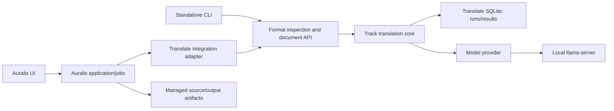

# Auralis Translate: independent translation module plan

Version 3.0 · 24 September 2026 · planning document, not an implementation report. The [original Russian version 2.0](../AURALIS_SUBTITLE_TRANSLATION_PLAN.md) remains at the repository root as a historical source. This English plan incorporates the agreed file-first MVP, separate Translate SQLite, and Auralis project links. The [architecture documentation](README.md) gives the binding MVP details; the [temporary implementation stages](IMPLEMENTATION_STAGES.md) are the agent-facing delivery sequence.

## 1. Goal and release scope

Translate an **existing** Chinese or Japanese subtitle file into Russian while preserving the supported source format and structure. Keep the original immutable and create a separate output. The first release is local desktop batch processing. The first validated language profile is Chinese → Russian; Japanese → Russian has its own later quality gate. The target language is fixed to `ru` in the product.

The first supported file subset is plain UTF-8 SRT, followed by a documented WebVTT subset. The module detects unsupported constructs before inference. A completed result must preserve cue count/order/identity, external timing, supported settings/markup and protected byte ranges. Missing translations and partial output cannot be labelled complete. A structurally valid result with linguistic warnings is attached to the project with a **Needs review** label.

Creating subtitles or timing from plain text, ASR, TTS, voice-performance markup, live translation, and dubbing-duration adaptation are separate workflows. A future text-only translation contract remains possible but is not a first-MVP gate. The module translates already-final text; it does not infer timing from it.

## 2. Current Auralis boundary

The initial Auralis survey on 24 September 2026 inspected `3a14658e2abeca22d3b9b406c679b813146ee310` on `refactor/maintainable-boundaries`. That historical snapshot had only dubbing jobs and mock ASR/TTS. The subsequent experimental integration adds translation jobs, project links, strict SRT/WebVTT import, managed checked-model execution, installation/selection and ready result publication. [Implementation status](IMPLEMENTATION_STATUS.md) records the tested paths and open gates. Auralis's separate normalising YouTube VTT parser drops tags and line breaks; the strict file translation path does not use it. Recheck the current checkout before extending integration.

Auralis owns projects, host jobs, source/output artifacts, process cancellation and resource limits. Translate owns parsing, segment mapping, translation planning, model-provider calls, validation, checkpoints, edits and result versions. The UI calls Auralis application APIs. It does not read Translate SQLite or invoke a model directly. Integration must extend existing Auralis mechanisms rather than silently create a competing project database or host scheduler.

## 3. Position in the wider media pipeline

An uploaded SRT/VTT file enters through Auralis as an immutable source artifact. YouTube captions must first be imported and, where needed, normalised by a source-specific Auralis adapter. ASR output can be translated only after it is finalised and represented as a supported source in a future stage. TTS and voice markup consume a selected Russian result later. Russian speech may have a different duration from the original; unchanged subtitle timestamps do not promise synchronised dubbing.

## 4. Architecture and repository connection

Use a separate Rust repository `auralis-translate`, initially developed beside Auralis. After publication on GitHub, add it at `auralis/modules/auralis-translate` as a Git submodule pinned to a commit. Auralis depends on the Rust crates through Cargo paths. Commit and push Translate first, then advance the submodule pointer in Auralis. Clone and CI workflows initialise submodules recursively. A direct Cargo Git dependency is an alternative only if physical nesting is no longer required. Dynamic Tauri plugins, a mandatory user Python environment, and a separate HTTP translation service are unnecessary for the initial desktop profile.

The Rust workspace has a format-independent core, formats crate, SQLite adapter, llama.cpp provider, and CLI composition crate. [Rust code architecture](architecture/004-rust-code-architecture.md) defines module splitting, tests and configuration. The Auralis adapter stays in the Auralis repository. Model weights, runtime binaries, downloaded media and third-party full subtitles do not belong in Git.

## 5. Model candidates and decision rule

The first experiment is direct Chinese → Russian translation with `tencent/Hy-MT2-1.8B`, initially its official GGUF Q4_K_M and Q8_0 files. The official Q4_K_M, Q6_K and Q8_0 files are approximately 1.13, 1.47 and 1.91 GB on disk; those sizes are not total RAM/VRAM requirements. Compare a 7B Hy-MT2 candidate, TranslateGemma 4B, and possibly a small general LLM on the **same** scenes using each model's correct template. Choose the lightest profile that passes structural, linguistic and resource gates. Do not train a model from scratch for the first version.

Model-card language lists and example outputs do not prove subtitle quality. Evaluate Chinese and Japanese independently. Do not use English as a default intermediate language. Preserve the exact licence, immutable model revision, weight checksum and notice obligations of the chosen distribution; conditions may differ among model families, conversions and runtimes. See [implementation status](IMPLEMENTATION_STATUS.md) for local evidence. A [matched 1.8B/7B Q4 development comparison](../eval/experiments/2026-09-27-model-size-comparison.md) is complete; independent language-quality gates are not. The [delivery plan](DELIVERY_PLAN.md) and [tracked backlog](IMPLEMENTATION_BACKLOG.md) govern the next context, long-file and dubbing work without loosening these product invariants.

## 6. Runtime and resource policy

The initial local provider uses a pinned `llama-server` build as a child process managed by the host. Record model revision/hash/quantisation, runtime build/backend, tokenizer and chat template, context size, response format, decoding settings, OS and hardware profile. A runtime feature such as schema-constrained JSON does not prove compatibility with every model template.

Start with one loaded model and one active generation, plus a bounded queue. Auralis controls a shared resource lease for ASR, translation and TTS; expensive stages run sequentially until coexistence has been measured. Start the service on loopback with appropriate local authentication, check readiness, and never log its secret. Translation does not require runtime tools, agent mode, arbitrary file access or a public listener. A call to the core engine must not implicitly download a model or start an uncontrolled process.

CPU with 16 GB RAM and a GPU with 6–8 GB VRAM are initial experiment benches, not published minimum requirements. Measure actual RAM/VRAM, cold start, wall time and release of resources. Select one first-release OS/backend combination; other platforms need their own smoke and benchmark.

## 7. Two public translation boundaries

`translate_track` accepts a versioned track snapshot and returns per-segment Russian text, statuses, diagnostics and provenance. It does not know any file syntax. `translate_document` accepts original bytes or a host-owned immutable source reference, format, encoding and policy; it uses `translate_track` and returns a **new** checked document. The document layer never overwrites the input.

The track request includes schema version, `translation_id`, `run_id`, source artifact ID/hash or equivalent immutable source revision, source/target language, ordered segments with unique internal IDs and timing, selected profile, policy, and confirmed glossary revision. Subtitle segments have valid timing (`start_ms < end_ms`); text-only segments are future work and must not be given invented zero timestamps. Internal IDs are independent of possibly repeated cue numbers in a file. Provider responses are independently checked for exact expected IDs, no duplicates, acceptable text, placeholders and completion.

The result records model/runtime/prompt/glossary fingerprints, accepted text by ID, diagnostic codes, attempts and measured duration. Source timing is reattached from the fixed snapshot, not accepted from model output. A fabricated model confidence percentage is not stored as evidence of quality.

## 8. Original preservation and supported formats

Keep the original file as an immutable Auralis managed artifact for the project lifetime. Translate stores its ID and SHA-256, not a second permanent copy of the bytes. A source map or concrete syntax representation identifies translatable and protected ranges. Build an output buffer/temporary file from the original bytes, replace only approved text slots, then reparse and compare structural invariants. Protected ranges must remain byte-identical, though their absolute offsets may move when Russian text is longer.

The initial strict SRT scope is valid UTF-8 with optional BOM and LF/CRLF, plain cues, known timing syntax and explicit multiline policy. The default `preserve` policy keeps the number of logical cue lines and separator types; a future explicit `reflow_text` policy may change line breaks within the same cue. If a natural Russian line does not fit, report a warning instead of truncating or changing policy silently. GBK, Shift-JIS and other encodings may not represent Cyrillic; reject or offer an explicitly chosen UTF-8 export rather than silently corrupting the source.

Format adapters, not a general regex, identify tags and protected tokens. Unsupported partial styling, nested spans, WebVTT ruby/inline timestamps/language spans, karaoke, and word/syllable timing are rejected in strict MVP unless a separate fixture-backed capability is added. WebVTT headers, cue identifiers/settings and permitted non-text blocks are preserved only within its declared subset. ASS/SSA, TTML, XML and arbitrary JSON are later adapters. A filename extension is never a blanket promise of all its syntax.

YouTube manual and automatic captions enter through Auralis. Source-specific rolling-event normalisation must preserve raw input and map source events to canonical cues; do not apply generic fuzzy deduplication that could erase actual spoken repetition. Strict preservation of a raw YouTube file cannot be claimed after normalisation. New words, timing, resegmentation and karaoke alignment require separate modes.

## 9. Translation planning and glossary

Inspect and validate the source before model startup. Freeze the source hash, parsing version, profile, glossary, policy and block plan. An initial experiment may translate 8–16 short target cues with 2–4 read-only neighbours on each side, but production block size is decided by actual tokenizer budget, template, glossary, output reserve, scene and speaker boundaries. Context cues may inform meaning but must not appear as target IDs.

A sentence can span multiple cues. Give the model the group as context while returning one translation per original ID; preserve the cue grid and flag doubtful source alignment for review. Do not redistribute a sentence by proportional word counts. Prompt and response shape belong to a tested provider profile, not one universal template. Keep names, facts, negation, numbers and tone; do not add explanations. A glossary contains confirmed source/target terms, allowed Russian inflections, scope and revision. Pass only relevant entries, detect conflicts before inference, and do not globally string-replace the model output. Previous machine translations and rolling summaries are outside initial context to avoid accumulating errors.

Reading-speed and line-length targets are diagnostics, not permission to shorten or retime. The initial proposed profile is at most two lines, around 42 visible grapheme clusters per line and 20 visible graphemes per second; measure and tune it for the product. Timing-based reading speed does not apply to text-only future input.

## 10. Validation, retries and failure codes

Validate in three layers before checkpoint or publication: structural schema/IDs/placeholders/completeness; linguistic or semantic risk signals (omissions, numbers, negation, terms, unexpected language); subtitle readability, cue mapping and export validity. Structural violations block acceptance. Semantic checks may require human review; they cannot mathematically prove fidelity for arbitrary dialogue. Latin names and short numeric replies must not be rejected by crude language heuristics.

Start with one primary model call, one reason-specific retry, and at most one split of an oversized block. The original plan proposes no more than four model calls per source block, including network retries, plus job time/token budgets. These are experimental policy values, not an invitation to retry indefinitely. OOM due to context may permit a smaller block; OOM due to model weights does not. Runtime failure never silently sends text to a cloud provider.

Typed diagnostic categories include unsupported language/format/feature, invalid source, unrepresentable encoding, missing or mismatched model, incompatible runtime, context overflow, OOM, invalid/truncated output, timeout/runtime exit, source revision conflict, user-edit conflict, persistence/export failure and cancellation. Keep stable codes and actionable user-facing messages. Full text is not required in system logs.

## 11. Translate state and Auralis project links

Use one separate `auralis-translate.sqlite` file per installation. Translate owns `translations`, `segments`, `runs`, `run_attempts`, accepted `block_checkpoints`, `results`, `segment_edits` and diagnostics. Auralis owns `project_translations`, `translation_publications`, host jobs, source/output artifacts and its outbox. The project receives a stable `translation_id` and active `run_id` **before** inference. A paused or failed run remains linked and resumable from accepted checkpoints. A ready result gets an immutable `result_id`; Auralis selects it only after its new artifact becomes ready. A prior selected result stays available during a new run.

The two databases do not have cross-file foreign keys or a general shared atomic transaction in the intended WAL setup. Auralis first commits an intent, then idempotently ensures the Translate records. Publication stages a file, commits a pending artifact/publication/outbox in Auralis, finalises the artifact, and conditionally advances the selected result. Reconciliation after startup repairs interrupted steps using stable IDs and source/output hashes. A missing Translate database is shown as an access failure, not a completed translation. See the [full lifecycle contract](architecture/002-storage-and-lifecycle.md).

Pause stops new blocks and cancels the active request; unfinished model output is discarded. Resume requires matching source, parser and profile fingerprints. Manual edits append revisions and never get silently overwritten by a model rerun. Deleting a project initiates idempotent Translate cleanup after the Auralis transaction and outbox commit. Raw model responses and temporary files may have a bounded retention period; accepted checkpoints, result provenance and edits stay while the project exists.

## 12. Cache and reproducibility

Cache keys include target text and ID/slot mapping, actual source context, language and confirmed scene/speaker facts, applied glossary, model weights/revision/quantisation, template/prompt/segmentation versions, decoding/output format, and any duration/readability constraints supplied to the model. Source revision remains attached to the run even if a content key permits reuse of unchanged blocks. A cached text result is rendered against the **current verified source map**, never against byte offsets from another document. A seed or low temperature alone does not guarantee byte-identical outputs across backends.

## 13. Events and user workflow

Useful progress events are model preparation, plan ready, block started, **block committed**, diagnostic, finalising and terminal outcome. Events carry stable IDs, saved counts and bounded diagnostics, not every streamed token as durable progress. Auralis uses its existing revisioned job/event and recovery conventions where applicable.

The [committed host event contract](architecture/013-committed-progress-events.md)
defines storage commit ordering and project-scoped snapshot refresh for the
existing lifecycle bridge. It keeps recovery polling for lost notifications.
Host job events do not expose per-token progress or infer preparation percentages;
richer preparation and diagnostic projections require their own contracts and evidence.

The user chooses an existing source file or project subtitle artifact, sees language and format limits, starts translation, can pause or resume, then compares original and Russian cues. A structurally valid but uncertain result is attached with Needs review. The user may edit segments, build a new result revision, select a result, and export it. A later TTS stage consumes the selected Russian text without rewriting the approved subtitle translation silently.

The [ready history contract](architecture/014-result-history-selection.md) separates
preview from project attachment. Explicit selection verifies the original and
existing immutable output, uses an expected host-link revision, preserves an
unfinished run and serializes with publication. Its [evidence](../eval/experiments/2026-09-26-result-history-selection.md)
includes a native latest-result edit followed by historical selection and reopening.
Editing an older base uses [explicit base/head observations](architecture/015-historical-result-edits.md),
a metadata-only host intent and a guarded immutable Translate branch. Manual
publication retains ready history when the observed project link changed and
preserves unfinished runs. [Application evidence](../eval/experiments/2026-09-26-historical-edit-application.md)
now covers supporting save and recovery across both databases and files. The
[desktop contract record](../eval/experiments/2026-09-26-historical-edit-desktop-contract.md)
adds typed observations/save/publication reads and experimental controls with
supporting backend/React evidence. The later [native branch record](../eval/experiments/2026-09-27-native-historical-branch.md)
verifies older-base saves, independent output ancestry checks, explicit selection
and reopening without inference replay. A [native core interruption](../eval/experiments/2026-09-27-native-historical-result-gap.md)
now recovers a committed branch as ready history without overriding a later
explicit choice. CLI branch delivery, journal-only and staged-file/outbox
interruption checks still gate the complete workflow.

## 14. Standalone CLI and delivery

Separate-model acquisition and installation use the same machine boundary:
`fetch-release`, `fetch-asset`, `install-offline` and `install-online` accept
versioned requests and report verified cache/package receipts. Cache progress
counts verified assets, not untrusted transferred bytes. Installing a package
does not start inference or select a host runtime. The
[package protocol evidence](../eval/experiments/2026-09-26-cli-package-protocol.md)
records process checks and real pinned-file installation separately from the
clean-machine and quality gates.

The CLI uses the same core, validators, profiles and formats as Auralis. Commands include `inspect`, `doctor`, `translate` and `resume`, with explicit JSON input/output and JSONL progress modes defined by [machine protocol v1](reference/cli-protocol-v1.md). In machine mode human diagnostics go to stderr and stdout contains only versioned records. Stable exit codes distinguish success, review required, invalid input, runtime failure, cancellation and persistence/conflict outcomes. The unflagged development interface retains its existing 0/1 behavior for current local tooling; it is not the new machine contract. A completed file is written through a temporary file and atomic replacement only after validation; an existing output is not overwritten without an explicit option. The original is never overwritten by default.

For local one-command use, the CLI may also own a checked model-server child
for the duration of a translation or resume. This is a separate process
supervision entrypoint around the same durable core, not an Auralis subprocess
integration. Explicit local model/runtime paths and a checked profile remain
required; no implicit download or model selection occurs.

A release manifest pins model ID/revision/filename/size/SHA-256, licence/NOTICE, runtime build/backend/checksum, tokenizer/template/prompt, decoding, supported languages/platforms and linked evaluation evidence. Download to a temporary file, support safe resume, verify checksum and atomically install; incomplete weights are not selectable. Updates create a new profile version and do not rewrite old translations. After initial installation the selected local profile must pass an offline smoke test on its declared OS.

## 15. Evaluation and release gates

### Delivery clarification

The application installer and Auralis GitHub release never include third-party model weights. The user explicitly chooses **Download and install** in the application; pinned upstream assets then enter application-data storage and are verified before selection. Separately supplied assets can be used through the offline installer. Neither path changes the product's source files or uploads weights to our own release. Test corpora, generated fixtures, comparisons, and SQLite test state remain development artifacts outside production bundles.

The proposed Chinese corpus is roughly 20–30 scenes and 500 cues, with about 200 for development and 300 held out by source video/scene. Japanese requires a comparable separate corpus. Include dialogue, names/terminology, idioms, negation, numbers, split sentences, speaker changes, overlaps, simplified/traditional Chinese, manual/ASR-origin text, Latin text, complex line breaks and protected elements. Keep a provenance and usage-rights manifest; do not commit unlicensed full third-party subtitles. The owner's current Chinese translator scope uses the [published-reference protocol v2](evaluation/011-published-reference-review-v2.md), with source-matched professional Chinese/Russian texts and explicitly labelled AI assessment. Automated judges and back-translation alone cannot close the semantic gate.

Measure meaning, Russian fluency, terminology, cue-time alignment, structural validity and retry rate, readability, cold start/full-file/p50/p95 time, RAM/VRAM and cancellation/recovery. Compare candidates on the same scenes with their correct templates. The proposed release goals, not measured facts, are:

| Gate               | Required evidence                                                                                      |
| ------------------ | ------------------------------------------------------------------------------------------------------ |
| G1 structure       | 100% of published strict outputs preserve IDs/order/external timing/protected ranges.                  |
| G2 no silent loss  | Every source segment has an explicit outcome; no hidden original-text fallback.                        |
| G3 meaning         | At least 95% of frozen eligible holdout cues have source/reference-supported adequacy ≥ 4/5; AI provenance, uncertainty and full denominator are disclosed. |
| G4 critical errors | No unresolved *detected* critical error in the release holdout; detection limits are disclosed.        |
| G5 terms           | At least 98% of applicable pre-frozen source-grounded terms are respected with Russian inflection considered. |
| G6 resources       | Measured SLA on the declared hardware; numeric limits chosen after initial benchmarks.                 |
| G7 durability      | Crash/resume preserves checkpoints and edits without duplicate accepted blocks.                        |
| G8 export          | Output reparses, opens in the target consumer and meets its declared format subset.                    |
| G9 packaging       | Clean target OS installs the model and passes a real offline smoke test.                               |

An earlier idea of translating representative subtitles for a 30-minute video within 10 minutes on GPU remains only a hypothesis until text density and hardware are specified. Report final cues/characters per wall-clock time, including retries, rather than only video duration.

## 16. Implementation checks

Test byte-identical parse/render without translation; protected-range and timing preservation; BOM/LF/CRLF, duplicate labels, empty/multiline cues, Unicode and overlaps; damaged inputs and unsupported markup; missing/extra/duplicate IDs, invalid JSON, truncation and placeholder damage; injection of block delimiters or tags; token budgets; cache invalidation after context/glossary/model changes; pause, cancellation, timeout, OOM, runtime/host crash and disk errors; source/edit conflicts; native real-model smoke and a long file with bounded memory. Parser property/fuzz testing is valuable because input is external and format preservation is central.

CI without weights checks formatting, lint, build, unit/integration and structural fixtures. A separate pinned-model workflow runs real inference and regression corpus checks. Store source/reference assessment and its provenance as evidence rather than calling a green build a language-quality result.

## 17. Implementation sequence and completion

The [temporary stages](IMPLEMENTATION_STAGES.md) start with inspect/extract, separate-file rendering with supplied text, and an early real-model call. Durable SQLite, CLI, Auralis integration, Chinese release and Japanese release follow. Each stage has an observable gate. The broader original 00–12 mapping is in that document.

The product is ready for an advertised profile only when the selected delivery path works; a real model has passed the current source/reference language gate; the declared SRT/VTT subsets preserve structure; text-only input is either explicitly out of scope or independently validated; pause/crash/resume and edit conflicts are safe; source and result/provenance remain available; and a clean declared OS/hardware configuration passes offline smoke, long-file and performance checks. A beautiful isolated model output does not close these gates. The integrated Auralis path is separately scheduled in the [desktop goal scope v3](../eval/experiments/2026-10-10-translate-desktop-goal-scope-v3.md) under the owner's explicit request; the translator-only CLI workstream remains distinct.

## 18. Risks and later extensions

Major risks are insufficient 1.8B quality, fluent but wrong meaning, content appearing at the wrong cue time, markup loss, unrepresentable encodings, word-level timing mismatch, YouTube rolling-caption duplication, resource contention with ASR/TTS, malformed model output, process/storage crashes, edit loss and model updates. The preceding validation, source map, benchmark, resource lease, checkpoints, revisions and manifest policies address them within their stated limits.

After the first language release, consider ASS/SSA without karaoke, complex VTT spans, explicit resegmentation, live provisional/final segments, a shared server/cloud provider chosen by the user, TTS-duration adaptation and possible fine-tuning from reviewed edits. Do not build microservices, Kubernetes, a vector database, autonomous agents or a training pipeline merely to translate the first file.

## 19. Instructions for future implementation turns

Read [AGENTS.md](../AGENTS.md), the architecture docs and actual repository state. Implement the smallest stage whose prerequisites exist. Preserve source immutability, source/result IDs, source mapping and database ownership. A fake provider proves contracts, not inference. Record commands, outputs, fixtures, model/hardware identities and known limits for each claimed gate. An agreed contract change requires a short ADR and documentation update. Auralis integration work must start from a freshly checked Auralis branch and schema, not the historical survey in this plan.

## 20. Primary references

These links support model/runtime/format capabilities, not measured Auralis quality. The original source survey was checked on 23 September 2026; verify exact releases again before pinning a production profile.

- [Tencent Hy-MT2-1.8B model card](https://huggingface.co/tencent/Hy-MT2-1.8B)
- [Official Hy-MT2-1.8B GGUF files](https://huggingface.co/tencent/Hy-MT2-1.8B-GGUF/tree/main) and [licence](https://huggingface.co/tencent/Hy-MT2-1.8B-GGUF/blob/main/LICENSE.txt)
- [Tencent Hy-MT2-7B model card](https://huggingface.co/tencent/Hy-MT2-7B)
- [TranslateGemma-4B model card](https://huggingface.co/google/translategemma-4b-it)
- [llama.cpp HTTP server documentation](https://github.com/ggml-org/llama.cpp/blob/master/tools/server/README.md)
- [Tencent Hy-MT2 repository](https://github.com/Tencent-Hunyuan/Hy-MT2)
- [Tauri external binaries](https://v2.tauri.app/develop/sidecar/)
- [W3C WebVTT specification](https://www.w3.org/TR/webvtt1/)
- [Aegisub ASS override tags](https://aegisub.org/docs/latest/ass_tags/)
- [Git submodules](https://git-scm.com/book/en/v2/Git-Tools-Submodules) and [Cargo dependencies](https://doc.rust-lang.org/cargo/reference/specifying-dependencies.html)
