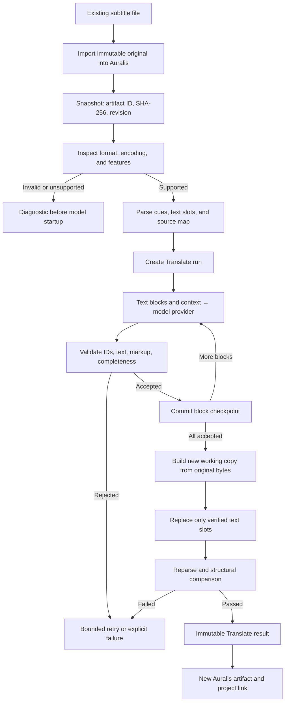

# File translation pipeline

Status: first-product contract, 24 September 2026. The [English product plan](../PRODUCT_PLAN.md) contains the broader format research and language-evaluation method.

## Scope and promise

Input is an **existing subtitle file** with cues and timing already present. Output is a **separate Russian file** in the supported source format, with a validation report. The original remains available for the lifetime of the project. Creating subtitle timings from plain text, recognising speech, preparing voice markup, and synthesising speech belong to other workflows.

The first implemented subset is plain SRT encoded as UTF-8, with LF or CRLF line endings and an optional BOM. A defined WebVTT subset follows its own fixtures and structural checks. A filename extension alone never establishes support for every feature of that format. Chinese → Russian is the first language release gate; Japanese → Russian needs a separate gate.

## End-to-end flow

## Immutable original and separate copy

In the embedded workflow, Auralis stores the source file once as a managed artifact. Translate receives its ID and bytes through the host adapter and records a SHA-256 digest. Translate SQLite stores the ID, digest, parse metadata, and source mapping; it does not keep another permanent copy of the file. On resume, Translate reads the artifact again and verifies its digest. Different bytes require a new source snapshot and translation identity.

The renderer constructs a new buffer or temporary file from the original bytes. It replaces permitted ranges in **that copy** and never opens the original artifact for writing. The final file receives a distinct artifact ID. For standalone CLI use, a CLI-owned working directory holds the immutable source; its ID/path and digest are recorded in Translate SQLite. The CLI must not overwrite an input or existing output by default.

## Steps and contracts

1. **Import and snapshot.** The host stores the original, declared language, format, artifact ID, and digest. A file with the same name but different bytes is a different source.
2. **Inspect before inference.** Check size, encoding, syntax, timing, and unsupported markup before loading a model. Report the cue position and cause when they can be established safely.
3. **Parse.** Produce internal stable segment IDs, original file labels/numbers, timing, translatable text slots, and protected byte ranges. A source map binds every slot to byte ranges in the fixed source. File cue numbers are not trusted as unique IDs.
4. **Plan.** Send the provider target texts with IDs, necessary neighbouring context, and confirmed terminology. The provider cannot change cue count, external timing, or file settings. Record the effective model profile and block plan.
5. **Translate and checkpoint.** Validate exact target IDs, complete output, legal text payload, and protected placeholders. Commit an accepted block to Translate SQLite before reporting it as saved progress. Reject partial output. Retry limits follow §10 of the product plan.
6. **Assemble.** For every source slot, select the accepted translation or approved edit. Apply it to a separate working copy. All ranges not declared translatable remain unchanged.
7. **Verify.** Reparse output and compare cue count/order/identity, timing, settings, and protected bytes. Confirm that no segment was lost, every payload is representable, and the source digest still matches. Create an immutable `result_id` only after these checks pass.
8. **Publish.** Auralis writes the new file as a managed artifact and links it to the project using [the storage protocol](002-storage-and-lifecycle.md). The source artifact remains unchanged.

## Strict-format invariants

For an advertised strict subset, cue count and order, external timing, source labels/identifiers, and supported non-text constructs are preserved. Protected source ranges remain byte-identical. Only declared text slots may differ. Longer Russian text shifts later byte offsets; verification compares protected content through the source map rather than using old absolute offsets in the output.

The default `preserve` policy keeps the number of logical lines within a cue and their separator types. A translation that cannot fit naturally produces a diagnostic; it is not silently shortened. A future explicit `reflow_text` policy may change line breaks inside the same cue. Model text must not introduce a new SRT block, timestamp, or service tag. Unsupported nested markup is rejected before inference. A missing segment ID can never be reported as complete.

Program validation can guarantee format structure and mapping. It cannot prove the meaning of arbitrary translated dialogue. Language, number, and glossary checks produce evidence and warnings; a bilingual reviewer and the corpus in §15 of the product plan decide whether a language profile is release-ready.
