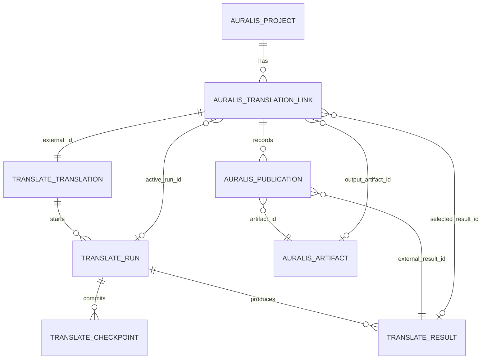
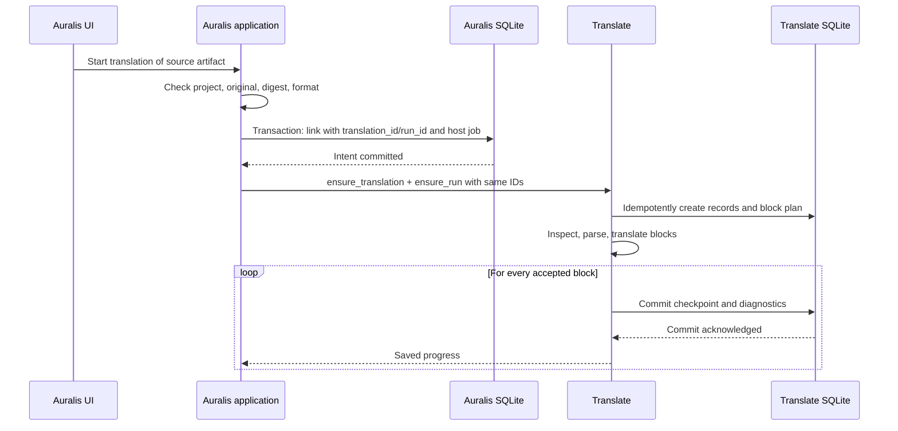
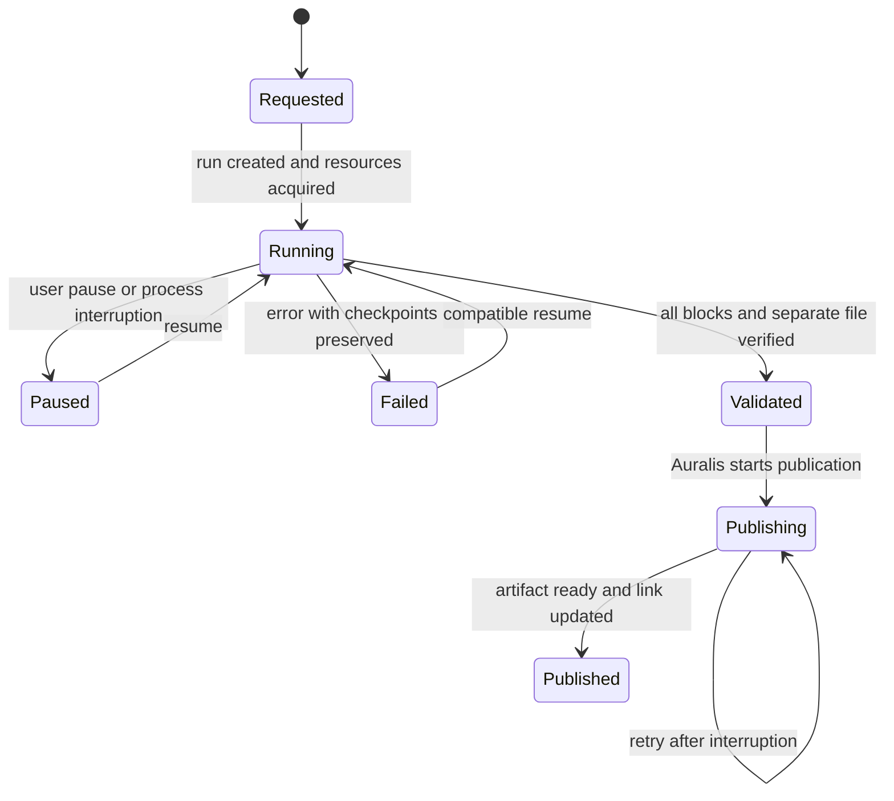

# Two databases and the translation lifecycle

Status: evolving contract, 24 September 2026. The owner chose **one Translate SQLite file per installation**, with records linked to projects by ID. The initial Translate schema and checkpoint/attempt primitives are implemented. Result creation and Auralis project publication remain proposals until their implementations pass the stage gates.

## Data ownership

| Owner | Data |
| --- | --- |
| Auralis SQLite (`auralis.sqlite`) | Projects, host jobs, project-to-translation links, publication records, source/output artifact IDs, and the publication outbox. |
| Translate SQLite (`auralis-translate.sqlite`) | Parse metadata and source maps, segments, runs, accepted checkpoints, effective model profiles, diagnostics, edits, and result versions. |
| Auralis managed artifact store | Bytes of the immutable original and every published output. |
| Translate temporary workspace | Working copy and unfinished output; never displayed as a ready result. |

Embedded Translate reads the original through an Auralis port. Its database stores `source_artifact_id`, `source_sha256`, format, parse version, and source mapping, not another permanent copy of the source file. The standalone CLI instead owns an immutable source in its own managed working directory. Translatable source text, accepted translations, edits, and provenance stay in Translate SQLite for comparison and reconstruction. Large model weights live in a verified file cache, not SQLite.

## Stable project link

Proposed Auralis table `project_translations` holds one row per source snapshot being translated. It includes an internal FK `project_id`, stable shared `translation_id`, internal FK `source_artifact_id`, `source_sha256`, nullable `active_run_id`, nullable `selected_result_id`, nullable `output_artifact_id`, and link revision. A project may have multiple links for different source snapshots, languages, or translation histories. The general Auralis project status does not stand in for a translation run status.

Proposed Auralis table `translation_publications` records each publication attempt: `translation_id`, `result_id`, `artifact_id`, finalisation state, and the small `needs_review` projection. `(translation_id, result_id)` is unique. It lets recovery find a pending or ready artifact even if the app crashed before updating the selected result. Full translation text and diagnostics are not copied to Auralis.

Both databases use the same `translation_id` as a logical identity. Translate `runs` represent execution; `results` represent immutable versions of selected segment text. `active_run_id` and `selected_result_id` may both be set: an old approved result remains available while a new run executes. Every result refers to its run and fixed source digest. `output_artifact_id` must correspond to the selected result. A source-byte change creates a new snapshot and link. A model-profile change that cannot safely resume the existing run creates a new `run_id`.

The key link values at each point are:

| Situation | `active_run_id` | `selected_result_id` | `output_artifact_id` |
| --- | --- | --- | --- |
| First run active or paused | Current run | `NULL` | `NULL` |
| First result validated but still publishing | Current run | `NULL` | `NULL` |
| First result published | `NULL` | Ready result | Ready artifact |
| New run with a prior selected result | New run | Previous selected result | Its ready artifact |

The UI reads progress and pause reasons from Translate through `active_run_id`. Auralis updates `selected_result_id` and `output_artifact_id` together in one conditional Auralis transaction after the artifact becomes ready.

## Translate SQLite tables

The table below describes the logical contract. Migration `crates/auralis-translation-sqlite/migrations/0001_initial.sql` contains the initial executable Translate schema; not all tables have repository operations yet.

| Table | Required content |
| --- | --- |
| `translations` | `translation_id`, external `project_id`, source artifact ID/digest, format, language pair, creation time. |
| `segments` | `translation_id`, stable `segment_id`, order, extracted source text, timing, source map, parser version. |
| `runs` | `run_id`, `translation_id`, state, source digest, model/prompt/runtime fingerprints, block plan. |
| `run_attempts` | `run_id`, attempt/host-job ID, start/end, pause or failure reason, actual runtime. Resume adds an attempt without changing `run_id`. |
| `block_checkpoints` | `run_id`, block ID, input fingerprint, accepted translations by ID, diagnostics and attempt count. `(run_id, block_id)` is idempotent. |
| `results` | `result_id`, `run_id`, revision, immutable manifest of selected segment versions, output digest, structural-check evidence, review flag. |
| `segment_edits` | `translation_id`, `segment_id`, edit revision, Russian text, provenance. A new edit never mutates an earlier result. |
| `diagnostics` | `run_id`, stage, code, time, related segment/block IDs and metrics; full raw model text is not required. |

Use ordinary FKs within Translate SQLite (`runs → translations`, `results → runs`, checkpoints → runs). IDs owned by Auralis are checked through the integration API and reconciliation. SQLite FKs cannot cross schemas; in WAL mode, writing attached database files is not atomic across the files as a set. `ATTACH` is therefore not a substitute for recovery. [SQLite foreign-key limits](https://www.sqlite.org/foreignkeys.html#fk_unsupported), [SQLite ATTACH transactions](https://www.sqlite.org/lang_attach.html).

The source link, source map, accepted checkpoints, results, edits, and effective fingerprints remain while the project exists. Working files, raw model responses and detailed runtime logs may have a bounded retention period; its exact duration must be chosen before production. Checkpoints and edit versions referenced by a result manifest are immutable. A new manual edit appends a revision rather than rewriting a published `result_id`.

## Start and checkpoint protocol

Auralis commits the intent **before** starting inference. `ensure_translation` and `ensure_run` are idempotent: repeating them with the same IDs and source digest returns the existing records; a different digest is a conflict. If the process stops after the Auralis commit and before the Translate write, recovery sees the incomplete intent and retries `ensure_run`. The UI displays starting/recovering rather than losing the project link.

The Auralis host job owns scheduling, process cancellation, and resource limits. The Translate run owns accepted translation checkpoints and detailed translation state. A resumed run may use a new host job/attempt while keeping its `translation_id` and `run_id`. Embedded Translate does not create a second background queue. The standalone CLI invokes the same core directly and resumes from Translate SQLite.

## Pause, failure, and result states

The diagram combines two state owners: Requested/Publishing/Published belong to the Auralis link, while Running/Paused/Failed/Validated belong to the Translate run. A persisted Running state with no live owner is marked interrupted at startup and made resumable. Pause stops scheduling new blocks. A partially generated response is discarded; only committed checkpoints count. Resume verifies source digest, parser/profile fingerprints, and model compatibility, then processes missing blocks. Explicit deletion is a separate action, not a synonym for pause.

Technical completeness and language review are separate. A structurally complete result with quality warnings is **published with `needs_review`**, so the user can compare and edit it. Missing segments cannot produce a publishable `result_id`. Model reruns never overwrite a manual edit.

## Publication and cross-database recovery

After structural validation, Translate stores immutable `result_id`, the selected-segment manifest, and the output digest. To retry publication, it rebuilds the output from the immutable original and referenced segment versions; the digest must match. Auralis verifies `translation_id`, `run_id`, source artifact and digest. It stages the output and creates a pending artifact, `translation_publications` row, and outbox message in a short Auralis transaction. After outbox finalisation makes the artifact ready, a separate conditional Auralis transaction updates the selected result and artifact ID. The condition includes the link revision and source digest so a late run cannot replace a newer selection. A pending artifact is never shown as published.

All steps are repeatable by `translation_id`, `run_id`, and `result_id`. On startup, reconciliation checks requested/publishing links, Translate runs/results, pending artifacts, and outbox messages:

| Failure point | Recovery |
| --- | --- |
| Auralis link exists; Translate run does not | Retry idempotent `ensure_run`. |
| Model returned a block; checkpoint was not committed | Retry the block; do not count partial output as progress. |
| Translate result validated; Auralis artifact absent | Rebuild and retry publication using the same `result_id`. |
| Artifact is staged or pending | Finish/retry the outbox action; do not select it yet. |
| Artifact ready; link still selects an older result | Find the artifact via `translation_publications`, verify digest/revision, then conditionally complete the link. |
| Translate database unavailable | Keep the Auralis link and any ready artifacts; report database access failure and never call an unfinished run complete. |

Project deletion commits in Auralis with related translation IDs recorded in an outbox action. The cleanup request to Translate is then idempotent. A backup/restore policy for both databases and a precise diagnostic-retention period remain production decisions; neither changes the stable identity protocol.
