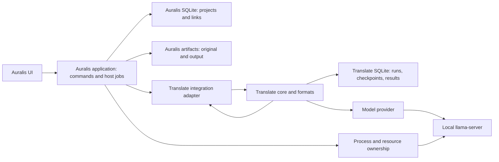

# Integrating Translate with Auralis

Status: integration in progress, 25 September 2026. `auralis-translate` remains an independent repository and builds without the Auralis UI. Auralis has durable project links, frozen run intents, and host translation jobs. Its inspection, registration, caller-driven host execution, versioned manual edit, and verified-result publication adapters call the pinned Translate libraries through application use cases. No desktop scheduler or UI runs inference yet.

## Module boundaries

Auralis owns projects, source/output artifacts, host jobs, process cancellation, resource limits, and the UI. Translate owns file inspection/parsing, source maps, segments, block planning, model-provider calls, validation, checkpoints, edits, and result versions. The UI calls Auralis application APIs rather than reading Translate SQLite. Future voice-markup and TTS modules consume an approved Russian result through Auralis; their state does not belong in Translate.

The same Rust core serves both the standalone CLI and the Auralis adapter. The CLI supplies its own files, SQLite path and runtime; Auralis supplies managed artifacts, host jobs and process ownership. Embedded Translate does not run a second scheduler on top of Auralis.

## Proposed integration API

| Auralis application operation | Effect |
| --- | --- |
| `inspect_translation_source` | Read a managed artifact and report format, language, limits and unsupported features without inference. |
| `start_translation` | Create stable link, host job and idempotent Translate run for a specific source digest. |
| `get_translation` / `list_project_translations` | Assemble link state, run progress, segments and available results by ID from the two databases. |
| `pause_translation` | Stop current work after acknowledged checkpoints while keeping link and resumable state. |
| `resume_translation` | Verify source/profile, create another host attempt if necessary and continue the same run. |
| `cancel_translation` | End the active attempt; deleting translation data remains a separate explicit action. |
| `publish_translation_result` | Validate `result_id`, stage a separate output and finish the managed artifact/outbox protocol. |
| `edit_translation_segment` | Append a revisioned user edit in Translate SQLite; rebuilding creates a new immutable result. |

Names are provisional. Formal DTOs are versioned before UI integration and carry `project_id`, `translation_id`, `run_id`, `source_artifact_id`, `source_sha256`, and `result_id` where needed. Every mutation checks ownership, link revision, and a valid state transition. Progress events contain IDs, stage, and the number of **committed** segments. System logs do not include full subtitle text by default.

## Current Auralis code and required changes

The current Auralis checkout inspected for this document is `3a14658e2abeca22d3b9b406c679b813146ee310` on `refactor/maintainable-boundaries`. These findings must be rechecked at integration time.

| Present now | Needed for translation |
| --- | --- |
| `projects`, `jobs`, `artifacts`, outbox, and SQLite as durable state. | `project_translations` and `translation_publications` migrations, conditional link transitions, reconciliation with Translate SQLite. |
| Cancellable host jobs and managed artifact staging/finalisation. | A translation job kind and application operations for pause/resume without abusing the general project status. |
| `OriginalSubtitle` and `TranslatedTranscript` artifact kinds. | Link the exact source artifact to `translation_id`; publish a ready translated file with its `result_id`. |
| Original YouTube VTT is stored as an artifact. | Run the strict Translate inspector/parser on original bytes. The current normalising VTT parser drops tags and line breaks, so it cannot support byte-preserving export. |
| A single `Transcript` in the project snapshot and only `Dubbing` in `JobKind`. | History of separate translation runs/results. Do not copy the new translated text into `projects.transcript_json` or `TranscriptSegment.translated_text`; the UI reads it through the Translate API. Existing imported transcript data needs a migration policy. |
| Mock ASR/TTS in `adapters-model`. | Managed production model runtime/provider and a resource limit shared with other expensive stages. |

This table records the initial code survey. Since then, Auralis has added `project_translations` and `translation_publications` tables and a typed storage port for run intent and ready-result selection. `adapters-translate::FormatInspector` uses the pinned strict SRT/WebVTT parsers, and `InspectTranslationSourceUseCase` accepts only a ready, project-owned managed `OriginalSubtitle`. It returns the source hash and text-slot map after checking indexed size; it does not write either database. A begin use case records the frozen link then idempotently creates Translate records; desktop startup replays active frozen intents after acquiring the application data-root lease and logs individual registration failures. `ExecuteTranslationUseCase` verifies the original and invokes `TranslateRunExecutor` against a caller-supplied local llama.cpp server. The executor requires a checked profile in its normal constructor, applies the same server and model-file preflight as the CLI, saves checkpoints, and commits a structurally validated `needs_review` result. `TranslationRunUseCase` exposes project-scoped status and durable pause requests; resuming calls execution on the same run, retaining accepted checkpoints. A publish use case renders the separate copy, verifies its digest, and selects it only after managed-artifact finalization. A mock HTTP integration test covers this two-database path and caller-driven host jobs; it does not prove real-model quality or managed model process ownership. Tauri commands expose strict source inspection, project-scoped run status, and durable pause; start, execution, publication, editing, UI, scheduler attachment, and process ownership remain. A parser that silently skips cues or flattens their markup cannot be a strict translation export path.

The current Auralis application also checks project/source/run identity before committing a manual edit in Translate SQLite. Each edit creates a new immutable result revision; a stale base cannot be edited. Auralis can publish a revision after a previous result is selected and the active run has closed. It derives the selected run from the ready publication, keeps the old output selected during staging, and changes the selected `result_id` only after the new artifact becomes ready. Source hash, selected run, and link revision checks reject a stale cross-database selection. A mock HTTP two-database test covers edits before and after publication, old output retention, and an unchanged original. A read-only desktop command now lists a project's translation links and exposes active run versus selected ready result identities through validated frontend IPC. The edit and publication use cases are not exposed to the desktop UI yet.

## Repository and build connection

The proposed nested path is `auralis/modules/auralis-translate`. Its separate GitHub repository contains the Rust workspace, documentation, fixtures and CI. After the first Translate commit is published, Auralis adds it as a **Git submodule**. The Auralis gitlink pins one Translate commit; upgrading requires a separate pointer commit in Auralis. Auralis uses Cargo `path` dependencies from `modules/auralis-translate/crates/...`; Translate remains independently buildable. Model weights, runtime binaries and user files do not enter Git.

A local Auralis checkout now has the pinned submodule path. `.gitmodules` uses the relative URL `../auralis-translate`, which resolves to the sibling repository in the same GitHub owner after that repository is published. Until the remote exists, a fresh network clone cannot initialise the gitlink; local development uses the sibling repository. The direct Rust dependency also requires one compatible `libsqlite3-sys` version for Auralis SQLx and Translate rusqlite. Translate pins rusqlite 0.39, whose SQLite FFI dependency is within SQLx 0.9's accepted range; both workspaces must pass their checks after changing that pin. [rusqlite 0.39 dependencies](https://docs.rs/crate/rusqlite/0.39.0), [SQLx SQLite dependency guidance](https://docs.rs/sqlx/0.9.0/sqlx/sqlite/).

Update order: commit/push Translate → pass Translate CI → advance the submodule in an Auralis integration branch → pass Auralis checks → commit/push Auralis. Auralis CI and local clones initialise the submodule with `git clone --recurse-submodules` or `git submodule update --init --recursive`. Builds never follow a floating `main` branch. The remote repository and access configuration still need to be created. [Git submodules](https://git-scm.com/book/en/v2/Git-Tools-Submodules), [Cargo path dependencies](https://doc.rust-lang.org/cargo/reference/specifying-dependencies.html).

## Delivery order

The detailed, agent-facing gates are in the [temporary implementation stages](../IMPLEMENTATION_STAGES.md). The planned order is: standalone contracts → strict SRT extraction → separate-file rendering → early real model call → durable Translate SQLite → quality and complete CLI → Auralis link/job/artifact integration → Chinese release gate → Japanese gate. SRT and model work can be tested before any Auralis migration. Auralis integration requires a separate branch and migrations in both database owners.

The [English product plan](../PRODUCT_PLAN.md) retains G1–G9 as release criteria for each advertised language, format and platform. A mock provider does not satisfy real-inference or bilingual-quality gates.

## Decisions still needed before production

- Target OS and measured CPU/GPU configurations. A Windows development machine alone does not establish a supported hardware profile.
- Real model comparison, weight/runtime revisions, licence obligations and distribution method. Hy-MT2-1.8B remains an experiment candidate.
- Exact WebVTT subset and handling of complex SRT cues, based on fixtures and tests.
- Retention period for raw diagnostics and temporary files. Original artifacts, selected results, edits and provenance remain until project deletion.
- Conditions for clearing `needs_review` after human review and a new result revision.
