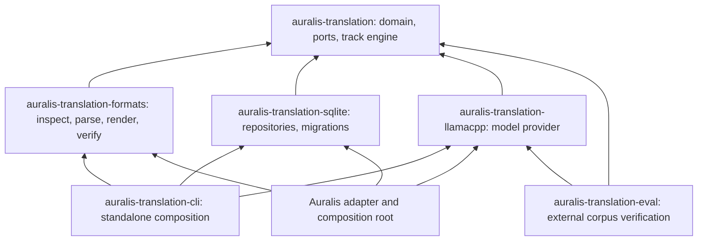

# Rust code architecture

Status: implementation guidance, 25 September 2026. All five runtime crates are present, including the durable Translate SQLite adapter. A sixth evaluation-tool crate verifies external corpus provenance and compares pinned sentence rows through the existing provider; no product crate or Auralis depends on it. The layout below illustrates dependency and ownership boundaries; actual modules have evolved as each behavior was implemented.

## Design goals

The translation engine must run in a standalone CLI and inside Auralis without duplicating parsing, model prompts, validation, or persistence rules. A reader should find one responsibility in one module. Files should remain small enough to understand without navigating unrelated types or test code. Infrastructure must depend on the core contracts, while the core must not depend on SQLite, Tauri, file paths, HTTP, or a specific model runtime.

The product workspace has five runtime crates. A new crate is justified only when it creates a real dependency boundary or a separately useful package. `auralis-translation-eval` is a standalone development tool: it pins and verifies evaluation data, reuses the checked model provider for auxiliary sentence comparisons, and is never linked into the translator or Auralis.



`auralis-translation` owns `translate_track` and format-independent segment contracts. `auralis-translation-formats` owns `translate_document`: it extracts segments, calls the core engine, and renders a separate output document. The SQLite and llama.cpp crates implement core ports. The CLI and Auralis provide concrete paths, process ownership, cancellation, and configuration. This direction avoids a circular dependency between the core and the format adapters.

The llama.cpp adapter exports model-file hashing and checked-server preflight for both the CLI and Auralis composition. The CLI no longer owns a separate copy of this verification. A checked profile compares the reported model alias, runtime build, minimum context, local model-file size, and SHA-256 before an attempt; an older experimental profile without runtime identity remains explicitly unchecked for saved-run compatibility. This preflight does not attest the server's in-memory weights or manage its process.

The same adapter now has separate `release_manifest/` and `offline_install/` modules. The manifest module validates versioned upstream asset identity against a checked profile; the installer module verifies local files, extracts a constrained archive, and stages an experimental package. The CLI only parses installation arguments and calls the installer. Auralis owns application-data placement and backend selection through its experimental package workflow. Keep package operations out of the core/domain crates; see [the installation boundary](007-model-installation.md).

## Suggested layout

The standalone CLI's machine interface is isolated in `reporting/`: one module
each for output format, event, envelope, summary, error code, failure and output
composition. `mod.rs` declares and exports these modules. JSON input has a typed
command enum and bounded versioned request document; dispatch still invokes the
same durable command implementations as positional input. `StartInput` groups
start configuration rather than adding another argument to every start variant.
The document-plan facade accepts a `ProgressSink`, and the CLI output adapter
implements that port without moving serialization or stdout into the core.
Behavior tests and process/socket helpers stay under the CLI's `tests/` tree.
See [machine protocol v1](../reference/cli-protocol-v1.md) for its public boundary.

The growing request concept now lives in `machine_request/`: `request.rs` owns
the tagged enum, `into_args.rs` converts it to positional dispatch, and `mod.rs`
only declares/exports modules. `PackageInput` freezes validated manifest/profile
bytes and backend once, including both online-install phases. Cache and installed
package receipt types have separate reporting files; package error classification
is separate from translation/store classification. The shared adapter's verified
asset observer is fallible, emits no text, and stops before the next asset when a
controller disconnects. Core/domain code does not depend on package IO or stdout.

```text
Cargo.toml
Cargo.lock
rust-toolchain.toml
Taskfile.yml
crates/
  auralis-translation/
    src/
      lib.rs
      domain/
        mod.rs
        translation_id.rs
        run_id.rs
        segment_id.rs
        segment.rs
        track_request.rs
        track_result.rs
        diagnostic.rs
      ports/
        mod.rs
        provider.rs
        checkpoint_store.rs
        progress_sink.rs
      application/
        mod.rs
        translate_track.rs
        block_planner.rs
        block_validator.rs
        run_policy.rs
    tests/
      track_contract.rs
      checkpoint_resume.rs
      support/
  auralis-translation-formats/
    src/
      lib.rs
      document/
        mod.rs
        inspect.rs
        translate_document.rs
        source_map.rs
      srt/
        mod.rs
        parser.rs
        renderer.rs
        verifier.rs
      vtt/                       # Strict plain-WebVTT format adapter.
    tests/
      srt_roundtrip.rs
      srt_rejections.rs
      fixtures/
  auralis-translation-sqlite/
    migrations/
    src/
      lib.rs
      connection.rs
      repositories/
        mod.rs
        run_repository.rs
        checkpoint_repository.rs
        result_repository.rs
    tests/
      migrations.rs
      recovery.rs
  auralis-translation-llamacpp/
    src/
      lib.rs
      request.rs
      response.rs
      provider.rs
      profile.rs
    tests/
      protocol.rs
  auralis-translation-cli/
    src/
      main.rs
      commands/
        mod.rs
        inspect.rs
        translate.rs
        resume.rs
        doctor.rs
    tests/
      cli_smoke.rs
  auralis-translation-eval/
    src/
      lib.rs
      main.rs
      manifest.rs
      verify.rs
      comparison.rs
    tests/
      flores_verification.rs
models/manifests/
schemas/
eval/
docs/
```

This is a starting map, not an instruction to create empty files. Add a file when its responsibility exists. A module directory is appropriate when a concept acquires multiple operations or subtypes; its `mod.rs` contains declarations and re-exports, not business logic. `lib.rs` exposes a small stable API. Prefer one primary public type or one operation per file. A small private helper may live beside its owner; unrelated structs, enums, parsers, repositories, and command handlers do not share a file. Avoid catch-all `types.rs`, `utils.rs`, and `helpers.rs` files.

## Dependency and ownership rules

| Layer | May contain | Must not contain |
| --- | --- | --- |
| Domain | Validated IDs, source snapshot identity, segment/result states, invariants, typed diagnostics. | SQLite queries, network calls, filesystem paths, Tauri DTOs. |
| Application | Block planning, provider calls, validation, retries, checkpoint order, cancellation-aware orchestration. | Concrete SQL, file format syntax, llama.cpp HTTP details. |
| Ports | Narrow traits for provider, checkpoint storage, progress, cancellation/resource access. | An application service locator or broad trait that exposes a whole database. |
| Formats | Strict inspection, byte ranges, parsing, rendering, structural comparison. | Model selection, SQLite writes, YouTube downloading. |
| SQLite adapter | Migrations, repositories, atomic writes within Translate SQLite. | Translation policy or Auralis project tables. |
| Model adapter | Versioned request template, runtime protocol, response decoding and capability declaration. | File parsing, result publication, direct user-project writes. |
| Composition | Concrete adapters, runtime path, storage location, lifecycle wiring. | Duplicate translation logic. |

Cross-database publication belongs to the Auralis integration adapter, not to a SQLite repository inside the core. Auralis alone writes its project/artifact database. Translate alone writes its translation database. Data crossing the boundary uses versioned IDs and DTOs from [the storage contract](002-storage-and-lifecycle.md).

## APIs, types, and errors

- Use distinct newtypes for `ProjectId`, `TranslationId`, `RunId`, `ResultId`, `SegmentId`, and `SourceHash` where they cross boundaries. Avoid passing arbitrary `String` values between stages.
- Use enums for format, language profile, run status, review status, and diagnostic code. Serialised names belong to versioned contracts.
- Constructors validate invariants such as nonempty IDs, unique segment IDs, `start_ms < end_ms`, source hash format, and a supported language pair. Parsing external data is fallible and returns typed errors.
- Keep the public API small: inspect a document, translate a track, translate a document, read/resume a run, and fetch a result. Internal planning details stay private.
- Every accepted block is persisted before a progress event reports it as saved. Provider output is untrusted even when it is valid JSON.
- Cancellation and timeouts are explicit inputs. Library calls never silently download a model, start an uncontrolled process, or mutate the source artifact.

## Configuration and hardcoded values

Avoid unexplained numeric and string literals in behavior. Put each value at the narrowest correct boundary:

| Kind of value | Location |
| --- | --- |
| Format syntax, such as the SRT timing separator | Named local constants in that format adapter. |
| Stable schema and protocol versions | Named constants next to their serialisation contract. |
| File-size limits, retry budgets, block sizes, timeouts, line policy | Validated configuration structs with explicit defaults and bounds. |
| Model revision, quantisation, prompt/template version, context limit, decoding parameters | Versioned model/profile manifest; record the effective values in each run. |
| Database path, artifact roots, runtime executable path | Supplied by the CLI or Auralis composition root, never embedded in the core. |

Do not collect every literal in a global `constants.rs`; that hides ownership. A named constant is appropriate for an invariant. An operational tuning value belongs to a typed policy or manifest so it can be tested and recorded. Defaults cannot replace validation of a real model's capabilities.

## Tests and quality gates

Keep production code under each crate's `src/` and behavior tests under its `tests/` directory. Put reusable test builders in `tests/support/`; never make production APIs public solely to test private helpers. Prefer tests of public behavior: byte-preserving round trips, source-map replacement, unsupported-feature rejection, model-output validation, checkpoint/resume, and cross-database recovery. Use small legal fixtures under `tests/fixtures/`. Property/fuzz tests for parsers are useful once the strict subset is working; they do not replace real file fixtures.

The repository Taskfile is the single entry point for build, format, lint, test, docs, and CI commands. CI without model weights verifies structure and lifecycle. A separate pinned runtime/model workflow performs real inference and evaluation. Keep a Rust toolchain and dependency versions pinned; centralise shared dependency versions and lints at the workspace root.

These conventions follow Rust's module and workspace mechanisms and its guidance on type-safe, validated APIs: [Rust modules](https://doc.rust-lang.org/book/ch07-00-managing-growing-projects-with-packages-crates-and-modules.html), [Cargo workspaces](https://doc.rust-lang.org/cargo/reference/workspaces.html), [test organisation](https://doc.rust-lang.org/book/ch11-03-test-organization.html), and [Rust API Guidelines](https://rust-lang.github.io/api-guidelines/).
