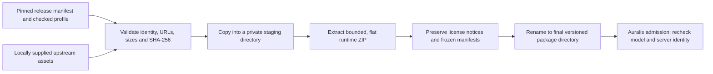

# Model installation and package boundary

Status: experimental offline package installer, 25 September 2026. This design covers a first Windows x64 CPU package. It does not establish a release installer, clean-machine compatibility, or a selected production backend.

## Ownership and flow

The Translate repository owns the versioned release manifest, asset verification, and package layout. Auralis owns the installation destination in application data, backend selection, runtime configuration, process admission, and removal policy. Neither repository stores model weights or runtime binaries in Git.

`models/releases/hy_mt2_1_8b_q4_k_m.windows_x64_cpu.experimental.json` pins the model file, checked profile bytes, upstream llama.cpp release, source commit, runtime archive, and both license notices. Each asset has an HTTPS origin, local filename, expected length, and SHA-256. The manifest is data, not a request to execute arbitrary URLs. Its validator accepts only the declared upstream repositories, revision-pinned model paths, release-tag-pinned runtime archive paths, and a commit-pinned runtime license path. A new variant requires its own archived digest and observed runtime evidence.

The standalone `install-offline` command accepts absolute source and destination directories. It reads assets from the source directory, verifies each complete copy, and extracts only regular flat ZIP entries with bounded file count and uncompressed sizes. A path, duplicate name, symbolic link, changed digest, or missing `llama-server.exe` aborts the install. Temporary directories are removed on handled failures. The final backend directory is created by a same-volume rename after all validation; an already existing final directory is never overwritten. A hard process kill can leave an `.installing-*` directory, which must be recovered under an owner-controlled installation root before a retry. The rename is the selection boundary, but this implementation does not claim power-loss durability of the parent directory metadata.

The package contains `model/`, `runtime/`, `notices/`, `release.json`, `profile.json`, and a retained copy of the upstream archive under `assets/`. The archive copy makes a complete package self-contained for provenance; Auralis may later define a space-saving policy after verifying it does not weaken repair or audit. Preserve license files contained inside the runtime ZIP as well as the separate top-level notices.

The installer returns the paths to the executable, model, and profile. It does **not** write Auralis `translation-runtime.json`, start a server, select this package for a project, or mark a language gate passed. Auralis must verify the selected package, configure its managed runtime, and use the existing admission checks before starting any run. The source subtitle remains an immutable project artifact, and the translated output is assembled separately; package installation never touches project files.

## Remaining release work

1. Choose and validate an intended Windows backend and clean OS/hardware profile. The current CPU package is an experimental baseline; CUDA needs a separately pinned runtime archive and companion dependency archive if selected.
2. Add network acquisition with bounded, resumable downloads, redirect policy, partial-file ownership, digest verification, error reporting, and offline installation from a complete cache. A failed download must never become selectable.
3. Connect Auralis installation and selection UI to application-data storage and its managed runtime configuration; define upgrades, coexistence, rollback, and removal with active-run protection.
4. Verify runtime startup, translation, pause/resume, and notices using the installed paths on a clean offline Windows machine. Record disk use, cold start, RAM/VRAM, and failure recovery for the chosen backend.
5. Do not close S6/S8 packaging gates from manifest validation, local installation, `doctor`, or a development-machine run alone.
