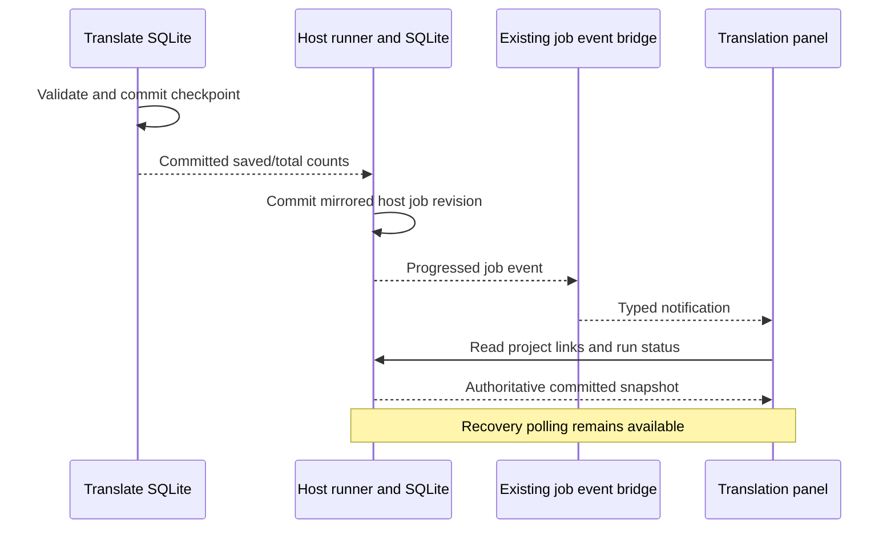

# Committed translation progress events

Status: implemented, 26 September 2026. [Supporting and native evidence](../../eval/experiments/2026-09-26-committed-progress-events.md) verifies the named paths below; S7 as a whole remains open.

## Decision and ownership

Use Auralis's existing `job-event` bridge for translation host jobs. A storage
decorator emits created, started, progressed and terminal notifications only
after the corresponding host storage operation succeeds. Failed writes emit
nothing. Translate checkpoints remain authoritative: their durable commit precedes
the mirrored host progress write. Events carry existing host job identities and
revisions, never subtitle text or provisional provider output.

The bridge remains bounded and best effort. Lag or publication failure triggers
the existing `job-events-invalidated` notification; neither event loss nor a
missing frontend changes a successful database operation into a failed run.
Prepare the bridge before constructing translation use cases; start its worker
only after fallible desktop initialization succeeds. Startup recovery uses the
same decorated store.

## Frontend behavior

Subscribe to translation job events for the displayed project, global job
invalidation, and that project's `project-updated` events. Publication is separate
from job completion: the project notification follows artifact finalization.
Every notification requests an authoritative link/status snapshot; event counts
are not written directly into the translation panel.

Coalesce notifications during an in-flight read into one subsequent refresh.
Only one read may be in flight for an observation generation. Dispose listeners
and timers on project change/unmount, including listeners whose registration
finishes after disposal. Ignore late reads from disposed generations. Keep the
three-second recovery timer for missed events or unavailable subscriptions; a
stalled listener registration must not block that fallback. Refresh after listener
registration to close the initial subscription/snapshot gap.

Existing preparation, pause, immutable-source, result-selection and review-label
contracts remain in force. Historical revision selection is separate S7 work.

## Required evidence

Verify event identity/revision/counts against real SQLite state, successful and
failed optimistic writes, all terminal outcomes and event loss. Component tests
must demonstrate a refresh before the recovery timer, coalescing, publication
refresh, project isolation and disposal. A native checked-model run is required
before claiming the real desktop event path is verified. These checks do not
establish language quality or close S7 as a whole.
