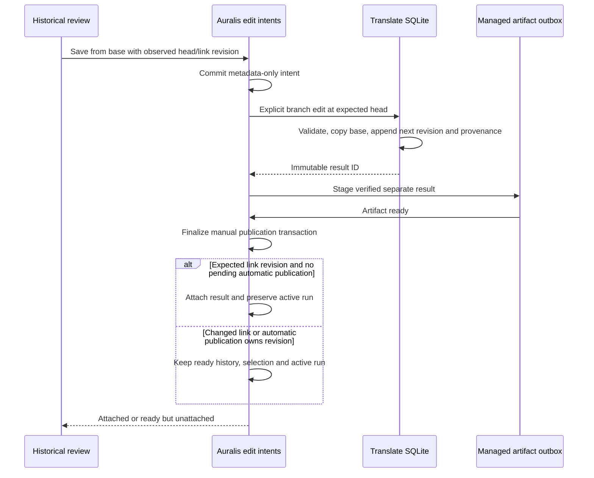

# Historical result edits with explicit concurrency guards

Status: implementation contract, 26 September 2026. Engine, host journal,
application recovery and typed desktop controls have supporting two-database/React
evidence. A later [native checked-model branch probe](../../eval/experiments/2026-09-27-native-historical-branch.md)
passes completed saves, explicit selection and reopening. The subsequent native
core interruption record passes committed-branch recovery with a later explicit
choice preserved. CLI delivery, journal-only and staged publication interruption
are still pending.

## Text base and observed head

An explicit historical edit has two distinct references:

- `base_result_id`: immutable text selection to copy and edit;
- `expected_head_result_id`: last result observed for that base's validated run.

Copy every untouched segment and inherited edit selection from the base. Do not
merge later text into the new result. Allocate the next per-run revision from the
current head, not from the base. In one Translate write transaction, require the
head ID to match the caller's expectation before appending. A stale or foreign
head fails without any result, edit or provenance write.

Keep the ordinary `commit_edit` latest-base-only behavior. A separate
`commit_branch_edit` operation makes historical intent explicit. Retrying the
same result ID and exact request is idempotent even after a later edit, provided
the saved text, structural evidence and provenance match. Reusing that ID with a
different base or expected head is a conflict.

Schema v6 adds `result_edit_provenance`, storing the new result's base, observed
head and changed segment. Results, segment edits and provenance commit together.
New ordinary edits also record their provenance with base equal to observed head.
Do not invent provenance for pre-v6 results: they remain readable with an absent
provenance value. Historical branching can still use their verified selection.
Keep typed IDs and format validation; structural errors never create a revision.

## Host publication and recovery boundary

Engine support alone does not complete the Auralis workflow. Before committing a
historical edit, the host must durably record an idempotent edit intent containing
project/translation/result/base/run IDs, observed Translate head, expected host
link revision and a bounded request fingerprint. Store no translated text in
Auralis SQLite. Translate owns the changed text and immutable result.

This intent allows startup to find a committed result even when its historical
run is neither the selected nor active run. An intent whose result was never
committed must remain retryable/interrupted without blocking other project work.
Publication reconstructs and verifies the result and creates a separate managed
artifact through the outbox. Do not replay inference to repair this boundary.

Final attachment requires a separate manual-edit publication transaction. Recheck
the expected host link revision and serialize against current pending automatic
publication. Preserve any unfinished active run. If the user or a new run already
changed the project selection, retain the ready revision as history and report it
as unattached instead of silently overriding that choice. Automatic publication
keeps its existing run/revision precedence rules. A newer inferred result must
remain recoverable if manual attachment changes the link while it is finalizing.

The frontend must acquire both observations before save, freeze the request/result
ID for retry, distinguish preview from attachment, and discard obsolete UI reads.
It must describe detached/conflicting publication honestly. Expose historical
editing only after this durable host path and its typed contracts are implemented.

### Desktop observations and outcomes

`get_historical_translation_edit_context_cmd` verifies the ready base and its
managed bytes, observes the head of that base's frozen run and verifies that head.
It returns scoped IDs, base/head revisions and the observed host link revision;
these are observations rather than locks. Save passes the exact head/link values
to `edit_historical_translation_result_cmd` and retains the complete request and
result ID on retry. Ordinary latest-base editing remains a separate command.

`get_translation_publication_cmd` reads one publication and its project link in
one host SQLite read transaction. A pending publication is still preparing its
file. A ready result may be attached or ready history: determine attachment from
that same snapshot's selected result ID. Never infer attachment from successful
staging or publication state alone. Reads are project/translation/result scoped
and return no filesystem path. A ready history entry remains explicitly selectable.

The review editor requests a context when opened and suppresses obsolete async
responses after its project/base/segment changes. It freezes input lines and both
observations before the first save. A transient retry reuses that request; a
confirmed pre-commit conflict requires a fresh observation and a new request ID.
The publication notice is kept outside the changing comparison page, refreshes
from committed events and bounded polling, and distinguishes pending, attached,
detached and failed output. Editing any verified historical ready base is allowed,
including an older run while another run is unfinished.

## Application request identity and verification

The host request digest uses the length-prefixed UTF-8 domain separator
`auralis-historical-edit-v1`, then length-prefixed UTF-8 project, translation, result, base, run and observed
head IDs, the expected host revision, changed segment ID, line count and each
unchanged UTF-8 line. Integer fields and byte lengths use unsigned big-endian
encoding (revision/lengths/count: u64; segment: u32). Creation time is excluded so
an identical retry preserves its original admission. Never trim or normalise text
for this identity. Store only the lowercase SHA-256 digest in the host journal.

Before admission, reconstruct the ready historical base from its frozen run and
verify its managed file size/digest, original bytes, parser, block policy and
profile identity. A new intent is admitted at the caller's expected host revision;
the branch transaction guards the supplied Translate head. Exact recorded retries
remain valid after selection or head changes, with the engine checking the saved
result identity rather than creating another revision.

Manual publication and startup replay verify the frozen run, reconstructed output
and stored edit provenance. Recover the changed lines from that verified result,
recompute the digest with the recorded metadata, and reject any ancestry or
payload mismatch before staging. Recovery pages advance past every entry, including
requests whose results were never committed; each failure is isolated. Such a
request remains interrupted/retryable and is never replayed as inference or an
invented edit. Ready output continues through the existing managed artifact outbox
and the explicit manual finalization contract below.

## Required evidence

SQLite tests must cover two-cue divergent ancestry, inherited edit selections,
monotonic revisions, identical retries after later edits, changed-request conflicts,
stale/foreign heads, concurrent writers, malformed text, corruption checks,
reopening, v5 migration and project cleanup. Add independent WebVTT coverage.

The complete host gate additionally needs two-database intent/result/publication
crash boundaries, conflicting selection and automatic publication, preserved real
unfinished runs, typed frontend interactions and a native checked-model edit from
an older version followed by reopening. The later native branch record proves
the completed-save/reopening case with independent ancestry and file checks;
it does not exercise process termination inside manual-save boundaries. Language
and clean-install gates stay open.

The [native core interruption protocol](../../eval/experiments/2026-09-27-native-historical-result-gap.md)
holds an older-base save after its committed result, permits an explicit newer
project choice, then kills/reopens the desktop. Its external oracle checks journal
digests, ancestry, unchanged checkpoints and detached ready recovery. The task
passed its actual invocation and independently verified ready history recovery
without replaying inference or replacing that newer choice. It does not cover
journal-only or staged-file/outbox interruption.

## Implemented foundation and remaining composition

Translate schema v6 and `commit_branch_edit` have supporting SRT and independent
WebVTT evidence in [the foundation record](../../eval/experiments/2026-09-26-historical-edit-foundation.md).
They append immutable results from the explicit base while guarding the observed
head. Origin reads also verify that the changed segment has matching persisted
manual text. Pre-v6 ancestry remains absent rather than fabricated.

Auralis schema v10 adds `translation_edit_intents` and the separate
`TranslationEditIntentStore` port. Admission checks project ownership, the current
link revision, a ready translated base artifact and its frozen owned run. It
records identifiers, expected versions and a canonical lowercase request digest;
it does not store lines. The caller still must construct the digest from a
versioned request and verify the Translate head and actual source/output bytes.
An identical recorded request remains retryable after a changed project selection;
a differing payload or identity conflicts. The first admission timestamp remains
stored when the same request is retried with a later observation timestamp.

Recovery enumeration uses bounded cursor pages in creation-time/result-ID order.
A missing/uncommitted result cannot occupy the first page forever and hide later
work: consumers must advance the cursor and handle each intent independently.
Ready publications leave that enumeration only with a ready translated artifact
owned by the same project and matching run. Link deletion cascades the journal.
No intent states are inferred from the current active run.

The separate `EditHistoricalTranslationUseCase` now verifies a ready historical
base, admits its digest to the journal and invokes the explicit branch adapter.
The ordinary editor remains latest-base-only. Publication can resolve an admitted
historical run independently of selection, verify the frozen run and edit digest,
and stage a separate result through the existing outbox. Production startup now
supplies the journal to publication/recovery and scans its cursor pages before
ordinary linked-run gap recovery. Supporting evidence is recorded in
[the application branch record](../../eval/experiments/2026-09-26-historical-edit-application.md).

The [desktop contract record](../../eval/experiments/2026-09-26-historical-edit-desktop-contract.md)
adds the typed observation/save/publication commands and experimental review
controls after those durable host boundaries were implemented. Their supporting
backend and component checks pass. The native branch record verifies older-base
save/reopening; the later core interruption record passes one actual process-kill
boundary with detached ready recovery. Journal-only and staged publication
interruption and the CLI branch route remain pending.
This experimental availability does not close the full S7 delivery gate.

## Manual publication transaction ordering

The schema v10 journal identifies explicit manual branches by result ID; do not
infer publication kind from revision numbers. Staging such a result checks the
journal's project, translation, run and expected link revision while allowing a
newer current selection or a different active run. Automatic staging keeps its
existing link/run/revision checks and ignores explicit manual branches when
checking automatic result precedence.

Manual finalization rechecks the ready owned base, frozen run, later result
revision, required manual `Needs review` projection, ready translated artifact and
matching immutable publication/journal metadata. Attach only when the observed link revision is
still current and no pending automatic publication exists at that current link
revision. Preserve the active run. Otherwise mark the branch ready for history
without changing the link. The ready state is terminal for this automatic manual
finalizer: later outbox retries never attach an earlier detached branch. A user
may subsequently attach it through explicit verified historical selection.

The outbox includes ready-artifact manual candidates even after selection/run
changes. Automatic candidate enumeration and precedence exclude manual branches,
so a detached manual result cannot strand an earlier automatic result. If manual
attachment wins before automatic staging, stale automatic admission fails safely;
the retained active run and durable Translate result remain available to normal
publication-gap recovery at the new link revision. Existing legacy ordinary edits
without a journal keep their previous precedence behavior.

The internal host port is now `finalize_ready_publication`, because completion
can produce either attachment or a ready historical artifact. Its automatic and
manual operations are split into separate modules under one transaction owner.
The outbox reports publication finalization rather than claiming every result
was selected. A selected newer manual revision also blocks older automatic
admission for that same run; another active run may still publish at its current
link revision. Supporting evidence is recorded in
[manual publication ordering](../../eval/experiments/2026-09-26-manual-publication-ordering.md).
