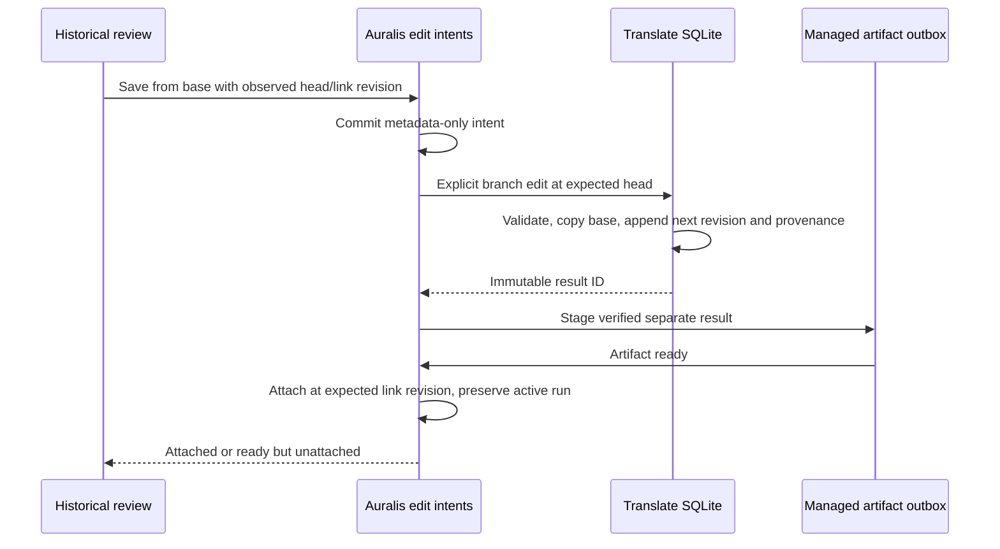

# Historical result edits with explicit concurrency guards

Status: implementation contract, 26 September 2026. The engine and metadata-only
host journal foundations have supporting SQLite evidence. Composition, CLI/UI
delivery and native branch evidence are still pending.

## Text base and observed head

An explicit historical edit has two distinct references:

- `base_result_id`: immutable text selection to copy and edit;
- `expected_head_result_id`: last result observed for that base's validated run.

Copy every untouched segment and inherited edit selection from the base. Do not
merge later text into the new result. Allocate the next per-run revision from the
current head, not from the base. In one Translate write transaction, require the
head ID to match the caller's expectation before appending. A stale or foreign
head fails without any result, edit or provenance write.

Keep the ordinary `commit_edit` latest-base-only behavior. A separate
`commit_branch_edit` operation makes historical intent explicit. Retrying the
same result ID and exact request is idempotent even after a later edit, provided
the saved text, structural evidence and provenance match. Reusing that ID with a
different base or expected head is a conflict.

Schema v6 adds `result_edit_provenance`, storing the new result's base, observed
head and changed segment. Results, segment edits and provenance commit together.
New ordinary edits also record their provenance with base equal to observed head.
Do not invent provenance for pre-v6 results: they remain readable with an absent
provenance value. Historical branching can still use their verified selection.
Keep typed IDs and format validation; structural errors never create a revision.

## Host publication and recovery boundary

Engine support alone does not complete the Auralis workflow. Before committing a
historical edit, the host must durably record an idempotent edit intent containing
project/translation/result/base/run IDs, observed Translate head, expected host
link revision and a bounded request fingerprint. Store no translated text in
Auralis SQLite. Translate owns the changed text and immutable result.

This intent allows startup to find a committed result even when its historical
run is neither the selected nor active run. An intent whose result was never
committed must remain retryable/interrupted without blocking other project work.
Publication reconstructs and verifies the result and creates a separate managed
artifact through the outbox. Do not replay inference to repair this boundary.

Final attachment requires a separate manual-edit publication transaction. Recheck
the expected host link revision and serialize against current pending automatic
publication. Preserve any unfinished active run. If the user or a new run already
changed the project selection, retain the ready revision as history and report it
as unattached instead of silently overriding that choice. Automatic publication
keeps its existing run/revision precedence rules. A newer inferred result must
remain recoverable if manual attachment changes the link while it is finalizing.

The frontend must acquire both observations before save, freeze the request/result
ID for retry, distinguish preview from attachment, and discard obsolete UI reads.
It must describe detached/conflicting publication honestly. Expose historical
editing only after this durable host path and its typed contracts are implemented.

## Required evidence

SQLite tests must cover two-cue divergent ancestry, inherited edit selections,
monotonic revisions, identical retries after later edits, changed-request conflicts,
stale/foreign heads, concurrent writers, malformed text, corruption checks,
reopening, v5 migration and project cleanup. Add independent WebVTT coverage.

The complete host gate additionally needs two-database intent/result/publication
crash boundaries, conflicting selection and automatic publication, preserved real
unfinished runs, typed frontend interactions and a native checked-model edit from
an older version followed by reopening. The existing history-selection evidence
does not prove this new workflow. Language and clean-install gates stay open.

## Implemented foundation and remaining composition

Translate schema v6 and `commit_branch_edit` have supporting SRT and independent
WebVTT evidence in [the foundation record](../../eval/experiments/2026-09-26-historical-edit-foundation.md).
They append immutable results from the explicit base while guarding the observed
head. Origin reads also verify that the changed segment has matching persisted
manual text. Pre-v6 ancestry remains absent rather than fabricated.

Auralis schema v10 adds `translation_edit_intents` and the separate
`TranslationEditIntentStore` port. Admission checks project ownership, the current
link revision, a ready translated base artifact and its frozen owned run. It
records identifiers, expected versions and a canonical lowercase request digest;
it does not store lines. The caller still must construct the digest from a
versioned request and verify the Translate head and actual source/output bytes.
An identical recorded request remains retryable after a changed project selection;
a differing payload or identity conflicts. The first admission timestamp remains
stored when the same request is retried with a later observation timestamp.

Recovery enumeration uses bounded cursor pages in creation-time/result-ID order.
A missing/uncommitted result cannot occupy the first page forever and hide later
work: consumers must advance the cursor and handle each intent independently.
Ready publications leave that enumeration only with a ready translated artifact
owned by the same project and matching run. Link deletion cascades the journal.
No intent states are inferred from the current active run.

The existing application editor does not yet call this journal or branch API.
Startup does not yet recover journal entries, and manual branch publication does
not yet have its separate attachment transaction. Do not expose historical saves
through the UI until those operations and their crash/concurrency evidence exist.
