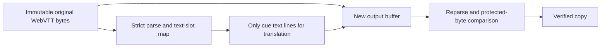

# Strict plain-WebVTT subset v1

Status: format-adapter and manual CLI contract, 24 September 2026. The parser and verified renderer are implemented in `auralis-translation-formats::vtt`. The CLI supports manual `inspect-vtt`, `template-vtt`, and `render-vtt`; WebVTT is not connected to the durable model-backed CLI or Auralis workflow. No general `.vtt` support is advertised yet.

This subset follows the [W3C WebVTT format](https://www.w3.org/TR/webvtt1/) but deliberately accepts less than the full syntax. Its purpose is to make text extraction and byte-preserving copy generation independently testable before model inference. Unsupported input fails as a whole; the adapter never silently drops a block.

## Accepted source

- UTF-8, with or without an initial BOM. Every line ending in a file is LF or every line ending is CRLF. A terminal newline is optional.
- The first line is exactly `WEBVTT` after the optional BOM, followed by a blank line. Header annotations and metadata are outside v1.
- One or more cues in nondecreasing start-time order. Overlap is allowed. Each cue has an optional unique identifier on its own line, an exact `start --> end` timing line, and one or more nonempty plain-text lines. The spaces around `-->` are exactly one ASCII space on each side; cue settings are outside v1.
- Timestamps use `mm:ss.mmm` or `hh:mm:ss.mmm` with at least two hour digits. Minutes and seconds are in `00..59`, and `end > start`. Arithmetic overflow is rejected.
- `NOTE` comment blocks, including `NOTE ` and `NOTE\t` starts, are permitted between cues and preserved byte-for-byte. A timing line inside a comment without a separator is rejected as an ambiguous missing separator.
- Blank lines between blocks and a trailing blank-line run are preserved. The default parser limits are 16 MiB per document, 100,000 cues, and 16 KiB per line; callers may supply a validated `VttParsePolicy`.

## Rejected before translation

`STYLE` and `REGION` blocks, cue settings, header annotations, cue tags, entities, inline timestamps, ruby, voice/language spans, karaoke, mixed or bare-CR endings, invalid UTF-8, duplicate cue IDs, malformed or decreasing timing, and empty cue text are rejected. For v1, a text line containing `<`, `>`, `&`, or `-->` is unsupported even if a full WebVTT player might accept it as literal text. A generic YouTube WebVTT export is therefore not automatically within scope.

The adapter does not normalise line breaks or infer timing. It does not translate `NOTE`, cue identifiers, or timestamps. Auralis must retain the immutable original source artifact. The standalone CLI has its own managed original for its current SRT path.

## Output and verification

`VttDocument::parse` exposes ordered internal segment IDs, optional external cue IDs, timing, and exact byte ranges for each translatable text line. Internal IDs do not depend on external cue IDs. `source_segments` passes the track snapshot to the format-independent core.

`render` requires exactly one translated record for every internal ID and exactly the original line count per cue. It rejects empty or unsupported replacement text, assembles a **new** byte buffer by replacing only declared text ranges, reparses it under the same policy, and compares cue order, IDs, timing, line counts, and every protected byte chunk. The source buffer is never mutated. A no-op render is byte-identical to the source, including BOM, comments, separators, and line endings.



The adapter tests cover byte-identical round trips for BOM/LF/CRLF/terminal variants, comments and cue IDs, separate-copy replacement, exact protected bytes, structural rejection cases, ID/line validation, and policy limits. This is format-contract evidence only. A durable WebVTT translation run, broader corpus and fuzz coverage, Auralis import path, and model-language validation remain open before WebVTT can be part of the Chinese release gate.

## Manual CLI path

From the repository root, for a file inside this subset:

```sh
task cli -- inspect-vtt source.vtt
task cli -- template-vtt source.vtt translations.json
task cli -- render-vtt source.vtt translations.json translated.vtt
```

Edit only `translations[].lines` in the generated schema-v1 JSON. The manifest binds the exact source bytes by SHA-256. `render-vtt` verifies the replacement and creates a new destination without overwriting an existing file. The original is unchanged. This path does not call a model, create a Translate SQLite run, or attach an Auralis project result.
