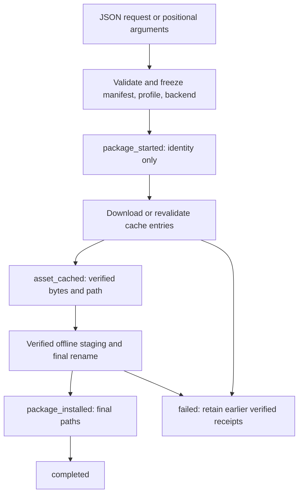

# Machine acquisition and installation of the separate model

Date: 26 September 2026. Scope: standalone CLI package operations on the existing
Windows development machine. This extends S6's controller interface; it does not
close clean installation, runtime ownership or language gates. Work remains local.

## Contract and implementation

The [additive machine protocol](../../docs/reference/cli-protocol-v1.md) now accepts
`fetch-release`, `fetch-asset`, `install-offline` and `install-online` through both
positional input and bounded versioned JSON requests. Output is final JSON or
streaming JSONL; ordinary positional output and 0/1 status remain available.



`install-offline` skips acquisition; fetch commands stop after their cache receipts.
Online installation freezes input bytes once for both phases. Final JSON retains
the latest asset rather than accumulating an event history; JSONL supplies every
verified asset. No command starts a server, selects an Auralis runtime or records
translation work. Asset integrity, busy cache, existing package, invalid package,
transport/HTTP and filesystem errors use typed codes without message matching.
The adapter's fallible verified-asset observer stops before the next asset after
an output error and retains already verified files.

The growing request module separates its enum, argument conversion and exports.
Receipt types and package error classification each have a focused reporting file.
Shared synthetic builders and proxy/process helpers stay under `tests/support/`.
No package or output dependencies were introduced into the translation domain.

## Process and adapter checks

`task check` passed formatting, workspace Clippy with warnings denied and workspace
behavior tests. `task test:cli:packages` passed ten CLI process tests, five existing
HTTP download tests and six offline/observer tests. The ten process cases cover:

- Every package request in both output modes, Unicode/space paths, pinned input
  hashes and cache/package receipts checked against actual fixture files.
- Unknown/missing fields, unavailable backend, undeclared filename, malformed
  profile and positional usage; relative cache/source rejection.
- A corrupt later cache entry after the first verified receipt; final JSON retains
  that first receipt and JSONL reports it before `asset_mismatch` without installation.
- Existing final package preservation after four successful cache receipts.
- An actual cross-process cache lock, corrupt and missing source files, archive
  path escape rejection and cleanup of handled staging failures.
- Legacy eight-line online-install output and legacy conflict exit 1.
- HTTPS proxy rejection through a bounded loopback proxy, without relaxing the
  production origin validator; exit 4 retains earlier receipts and an untrusted
  partial without publishing its cache name.
- A closed stdout pipe before a deliberately oversized initial record can be
  delivered; exit 6 precedes acquisition/installation. The separate observer
  regression verifies a reporting error after verification preserves that asset
  and stops before checking the next one.

Synthetic model/executable bytes were never executed and prove package/protocol
behavior only. Existing HTTP tests exercise local full/Range transfers, ignored
Range, wrong Content-Range and insecure redirect rejection.

## Real pinned-asset probe

Executed successfully:

```powershell
$env:AURALIS_PACKAGE_PROBE_FETCH_NOTICE = '1'
task eval:cli:packages ASSET_DIR=E:/Anything/Projects/Commercial/auralis-translate/.cache/download-smoke
```

The task builds the optimized CLI, runs the package regressions and executes
`eval/scripts/cli-package-probe.mjs`. The first harness invocation failed before
launching a CLI because the manifest omits optional `companions`; the harness
now applies the adapter's empty-list default. The successful invocation retained
all inputs, stdout/stderr and `report.json` under ignored storage:

`E:/Anything/Projects/Commercial/auralis-translate/.cache/eval/cli-package-72992fa0-20ba-4477-8d46-832c18c245fd/`.

| Identity | Observed SHA-256 |
| --- | --- |
| Optimized CLI | `32e5d914633c81b9fdd34a3996e248e910ae5022420946d040165265a0dddf95` |
| Release manifest | `33550fb32ffe357443ee3f1b372b816b055a5155d5d3697245a04a45c7b799cb` |
| Checked profile | `dba1d341230bc4f1117c6fba8ce55a1127b120864aa8363295bdbc883b98fc3e` |
| Model | `dc5f44fcf1fa496ee7ad725982c0c8c553a4de00259b53af84c4b89fb0c06699` |
| Installed CPU executable, both packages | `6f15be27bd80b6b4d52afefa49094e18fcfab55d5da354d717971f2d2537b2f4` |

The probe independently streamed SHA-256 over every supplied real asset and
reported cache file, both installed models, frozen manifests/profiles, notices
and retained runtime archives. It checked the final executable path and recorded
its digest, without claiming runtime execution. Observed operations:

1. JSONL `fetch-release`: four verified cache receipts, then exit 0.
2. JSON `fetch-asset`: one verified model-notice receipt, exit 0.
3. JSON `install-offline`: a separate real package and installation receipt, exit 0.
4. JSONL `install-online`: four receipts and another separate package, exit 0.
5. Repeated online installation: four receipts then `conflict`, exit 7; independent
   package checks remained unchanged and no installation receipt was emitted.
6. Fresh JSONL model-notice fetch: actual pinned upstream HTTPS acquisition into
   an empty cache; 11,639 bytes, SHA-256
   `a1d52d448f81c584a47c583e19dfab2d3851c7c84431b07baee093c1113ed114`,
   one verified receipt and exit 0, with no residual partial file.

Model weights were reused from the separately supplied complete cache, not
downloaded again or embedded into an app. Installed packages, reports, SQLite
fixtures and external assets remain ignored and outside release publication.

## Limits and remaining work

This is an existing-machine package probe, not an unseeded Windows installation.
The fresh acquisition exercised only the notice, not a deliberately interrupted
real weight/CDN transfer. It did not start inference, compare linguistic output,
attest in-memory weights, or test package power-loss recovery. Existing real-model
translation records retain their separate scope. S6 still needs CLI-owned runtime,
finer typed provider failures, upgrade/removal and orphan cleanup; S8/S9 need
representative subtitle review and the clean offline delivery protocol.
