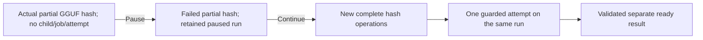

# Native initial model-hash pause and fresh resume

Date: 26 September 2026. Translate implementation: `6373bd0`; Auralis extends
local `49550ba` with the named observer and launch mode. Development remains local.
The final native invocation exits 0 after ready-file and cleanup verification.
This closes the named initial-hash interruption boundary only.

## Observed boundary

`task desktop:e2e:native:translation:initial-hash-pause` uses the existing native
Start/Pause/Continue scenario and both real SQLite databases. It observes sparse
adapter diagnostics after actual GGUF bytes have been read and hashed. Before
releasing the real Pause button, the observer requires an unfinished operation,
`0 < hashed_bytes < total_bytes`, no new model process, the retained source/run
identity, and zero host jobs, host associations, Translate attempts, checkpoints,
results, publications and translated artifacts.

The project-title handshake only coordinates observation and the existing UI
actions. It does not suspend, slow down or replace hashing. Pause must advance the
durable control revision once and acknowledge an idle retained run without a
partial result. The same hash operation must then finish with `failed` and fewer
than all model bytes consumed. No digest from that operation can authorize resume.

Continue performs fresh complete model checks and completes the same run through
one closed host job and one closed Translate attempt. The normal native verifier
requires a ready separate result, retained original bytes, protected subtitle
structure, result/source comparison and completed outbox publication. Final child
release is observed separately.



These diagnostics are observational, process-local counters. They are not durable
translation progress, an attestation of loaded weights or language-quality
evidence. The adapter installs no tracing subscriber and emits no paths, subtitle
text or error messages. The host owns logging and model-process management.

## Inputs and repeatable command

The source is the authored one-cue Chinese SRT `你好。`. It is not a representative
subtitle corpus. The existing ignored Hy-MT2 1.8B Q4_K_M file has
1,133,080,448 bytes and checked SHA-256
`dc5f44fcf1fa496ee7ad725982c0c8c553a4de00259b53af84c4b89fb0c06699`.
The supplied llama.cpp build is b10977-0ecb159c9. Native settings request context
2048, 99 GPU layers, one slot and zero RAM cache on the local Windows/CUDA bench.

From the Auralis checkout, with the prepared media fixture tools available:

```powershell
$env:AURALIS_TEST_LLAMA_SERVER = 'E:/Anything/Projects/Commercial/auralis-translate/.cache/runtime/llama/llama-server.exe'
$env:AURALIS_TEST_GGUF = 'E:/Anything/Projects/Commercial/auralis-translate/.cache/models/Hy-MT2-1.8B-Q4_K_M.gguf'
$env:PATH = 'E:/Anything/Projects/Commercial/auralis-translate/.cache/runtime/cudart;' + $env:PATH
$env:AURALIS_NATIVE_E2E_MEDIA_READY = '1'
task desktop:e2e:native:translation:initial-hash-pause
```

The initial observer-only attempt and its Taskfile-filter repeat failed with
`Requested preparation boundary was not observed`. The inherited `RUST_LOG=warn`
suppressed the required INFO records; the observer correctly refused to release
Pause without evidence. Both invocations reached terminal failure and removed
their isolated application-data roots before another invocation began. The final
harness sets `warn,auralis_translation_llamacpp::model_hash=info` directly on its
test application child, overriding the inherited filter only in this named mode.
It does not change installed application settings.

## Supporting verification

- Translate `task check`: formatting, Clippy with denied warnings and workspace
  tests pass, including CLI protocol and package process regressions.
- Translate `task test:preparation`: two hash diagnostic tests, two controlled hash
  tests, five request-cancellation tests, six package/observer tests and one CLI
  preparation-pause process test pass.
- Auralis `task desktop:e2e:native:preparation:check`: sixteen observer tests pass.
  They reject admitted/partial records, missing counters, wrong identities and
  ownership, ambiguous or complete initial hashes, invalid terminal counters, and
  resume without a distinct complete hash operation. These are verifier checks.
- Auralis `task quality:file-size` and `task quality:duplicate-code`: pass.
- Auralis `task rust:clippy`: passes the locked workspace/all-target check with
  denied warnings. `task rust:test:translate`: fifteen adapter tests pass; two
  asset-dependent checks are opt-in and remain ignored in this invocation.
- Auralis `task fe:build`: production bundle budgets and delivery checks pass for
  sixteen frontend files, without native test modules, weights or test data.
- Auralis `task quality:format-write -- tools/native-e2e/hash-observation.mjs tools/native-e2e/hash-observation.test.mjs tools/native-e2e/preparation-pause.mjs tools/native-e2e/run.mjs Taskfile.yml`: pass.
- Translate `task docs:check`: local links pass across 72 active Markdown files.
  Auralis `task docs:check`: five checker tests and the 31-file documentation
  contract pass. Its first sandboxed invocation failed with `spawn EPERM`; the
  exact local task succeeds when child-process execution is permitted.

## Native observations

The final invocation observes operation 1 start after 65,536 actual bytes and fail
after 3,604,480 of 1,133,080,448 bytes. Start and terminal timestamps are
`2026-09-26T17:01:28.165998Z` and `2026-09-26T17:01:28.419775Z`.
Fresh operation 2 starts at `2026-09-26T17:01:28.701996Z` and completes all model
bytes at `2026-09-26T17:02:45.191421Z`. Operations 3 and 4 independently consume
all 1,133,080,448 bytes and complete at `2026-09-26T17:04:07.109411Z` and
`2026-09-26T17:05:23.506619Z`. The three fresh checks cover resumed initial
verification, managed post-launch verification and worker preflight.

The UI acknowledges the initial Pause in 52 ms. All seven admitted/partial counts
are zero at pause, the control revision advances from 0 to 1, and no new model
PID exists. That acknowledgment is the actual button-to-UI observation; it is
not the elapsed duration between hash diagnostic timestamps. Continue retains
the same run and source, restores preparation controls after panel remount,
completes one closed host job and one closed Translate attempt, publishes a
separate ready `needs_review` result and releases the managed model child. Both
originals retain their initial digest; the temporary application-data root and
native frontend build are removed. The invocation exits 0.

| Final invocation | Value |
| --- | --- |
| Run | `0b33d519-6930-4469-a6c9-147f52ebe8c8` |
| Translation | `76085174-1043-459a-966a-1afff486905e` |
| Completed resumed host job | `ef7d7629-4c6c-4d73-b0ae-6499eb83dff4` |
| Pause UI acknowledgment | 52 ms |
| Paused host jobs / associations / Translate attempts | 0 / 0 / 0 |
| Paused checkpoints / results / publications / output artifacts | 0 / 0 / 0 / 0 |
| Paused new model PIDs | none |
| Interrupted hash bytes | 3,604,480 of 1,133,080,448 |
| Fresh complete hash operations | 2, 3, 4 |
| Final closed attempts | 1 |
| Source SHA-256 | `e88cbac25d7b05d1bd1f19d738b2eb3d8b5198e5ad550b9960f1de98cc0776a8` |
| Output SHA-256 | `e1bd07b25695411ec29cc5a55813e3c0e7094de94cebf8c3e528682127325cf3` |

The 52 ms acknowledgment is one debug-build observation, not a responsiveness
SLA. Hash counters measure actual adapter work; they do not identify the exact
instant at which the UI thread persisted its pause request.

## Remaining scope

Repeated/concurrent commands, deletion/publication interleavings and actual Windows
kill/reap failure remain separate work. This one-cue test cannot select a production
language profile, establish a general responsiveness/hardware SLA, certify clean
Windows installation or close S4/S7/G7 as a whole. Models and test payloads remain
separate from Git and application/release content. Public publication is deferred.
