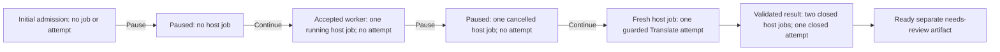

# Native accepted-worker preflight pause and fresh resume

Date: 26 September 2026. Implementation follows local Auralis `85e1fcc`, with
Translate pinned to `d54b4bd`. Both the first full invocation and the rebuilt
final-helper repeat pass. Development remains local; weights and corpus payloads are not
downloaded or published in this tooling slice.

## Scenario and boundaries

`task desktop:e2e:native:translation:worker-preflight-pause` enables an additional
test-only boundary in the existing preparation scenario. It keeps the prior
post-child pause before any host job exists, then resumes the retained run. The
actual run panel is remounted when its desktop status reports an accepted host
job while Translate remains paused. Preparation and Pause must still be visible,
and another Continue action must be unavailable.

The outer observer waits for that UI boundary and reads both SQLite files. Exactly
one running translation host job and one open run association must exist, with
zero Translate attempts, checkpoints, results, publications and translated
artifacts. It verifies the model child's Windows parent equals the actual desktop
PID, source/link/run identity is retained and original bytes have the initial
digest. Only then does it release the actual panel's Pause click through the
test project-title gate. The gate coordinates observation; it does not block,
delay or replace model preparation.

The panel must acknowledge pause within its existing ten-second test bound,
show an idle retained pause with Continue available and no alert, and report no
active host job or result. The observer then requires that the same host job is
cancelled, its association is closed, the durable control revision increased,
the run still belongs to the project, all partial-result counts remain zero and
the model child is absent. Child absence is sampled after UI acknowledgment; it
is not a measurement of the exact termination instant.

Fresh resume clicks Continue again in the same desktop and completes the same
run. Final checks require two closed host jobs (one cancelled and one completed),
exactly one closed Translate attempt tied to the completed job, a ready separate
`needs_review` output, unchanged external/managed originals and released model
children. The normal result verifier still checks cross-database revision/digest,
source comparison, preserved timing and acknowledged outbox finalization.

The immutable source and project-linked run retain their identities through both
pauses; the project selects a result only after separate-artifact publication.

## Inputs and environment

The source is the authored one-cue Chinese SRT `你好。`, not a language evaluation
corpus. Installed llama.cpp b10977-0ecb159c9 and the checked Hy-MT2 1.8B Q4_K_M
model are supplied through `AURALIS_TEST_LLAMA_SERVER` and `AURALIS_TEST_GGUF`.
Local CUDA is on PATH and prepared media tools are reused. The native managed
runtime requests context 2048, 99 GPU layers, one slot and zero RAM cache.
Each invocation uses its own temporary application-data root and removes that
sandbox and the native-only frontend build when terminal.

## Supporting verification

- `task desktop:e2e:native:preparation:check`: eleven observer tests pass. They reject
  partial/admitted records, stale identity, wrong job ownership/kind, missing or
  duplicate associations, omitted required counters and invalid terminal state. These are verifier tests,
  not real model evidence.
- `task fe:typecheck`, `task fe:lint`, `task q:fsd-boundaries`,
  `task q:ipc-contract`, `task q:file-size` and `task rs:clippy`: pass.
- `task q:duplicate-code`: initially rejects repeated Pause acknowledgment code
  inside the native scenario. A common actual-button helper removes the duplicate
  without changing timing, predicates or IPC; the check then passes. The first
  native invocation predates that refactor and required-count strengthening.
  The rebuilt repeat below passes against both final changes.
- `task fe:build`: bundle budgets and actual delivery checks pass for 16 emitted
  frontend files, with no emitted native modules, weights or test data.

## Native observations

The first `task desktop:e2e:native:translation:worker-preflight-pause` exits 0.
Initial admission pause acknowledges in 775 ms with all seven counts zero. The
accepted-worker pause acknowledges in 3059 ms, closes its cancelled host job,
increments the durable control revision from 1 to 2 and leaves no Translate
attempt/checkpoint/result/publication/output artifact. Both paused verifications
observe no remaining owned model child. Final resume creates a different
completed host job and exactly one closed Translate attempt on the same run.
The normal ready-file/source/outbox checks pass and the sandbox is removed.

| First full invocation   | Value                                                              |
| ----------------------- | ------------------------------------------------------------------ |
| Run                     | `df73f6e7-7497-4a7d-9aee-19fc6514b08e`                             |
| Translation             | `78590ae2-4a43-45a6-b719-e456c4f452d3`                             |
| First admission child   | 27476                                                              |
| Accepted-worker child   | 14524                                                              |
| Cancelled preflight job | `e60b8527-ad3f-4ab5-a3b8-ddf9a471201d`                             |
| Completed fresh job     | `c6bb86b0-3fdf-4e9e-920e-aa9199ae72be`                             |
| Source SHA-256          | `e88cbac25d7b05d1bd1f19d738b2eb3d8b5198e5ad550b9960f1de98cc0776a8` |
| Output SHA-256          | `e1bd07b25695411ec29cc5a55813e3c0e7094de94cebf8c3e528682127325cf3` |

That first binary predates the common acknowledgment-helper extraction and
required-count observer strengthening. The final rebuilt repeat also exits 0:
initial admission acknowledgment is 213 ms with all counts zero, and accepted-worker
acknowledgment is 3056 ms with only the cancelled host job/closed association
retained. Control revision again advances from 1 to 2. Fresh resume completes
one Translate attempt through a different host job, retains the same source/output
digests, publishes the ready separate result and releases the model. Its sandbox
and native frontend build are removed.

| Final rebuilt repeat                | Value                                  |
| ----------------------------------- | -------------------------------------- |
| Run                                 | `0e547509-2c10-4ba8-b612-61afa994a42e` |
| Translation                         | `06505178-cfed-4843-813f-7444cdd4b286` |
| First admission child               | 5552                                   |
| Accepted-worker child               | 19580                                  |
| Cancelled preflight job             | `827f8c8a-bc97-41e3-a175-8499c2ff025f` |
| Completed fresh job                 | `5c516e74-fd76-4212-9a39-373f89859006` |
| Initial admission UI acknowledgment | 213 ms                                 |
| Accepted-worker UI acknowledgment   | 3056 ms                                |

These are individual debug-build observations. Worker acknowledgment includes
the panel's status polling; it does not measure the exact hash cancellation or
child termination instant. The owned process is sampled absent at paused
verification and after final completion. No production responsiveness SLA is
inferred from either invocation.

## Remaining scope

Initial-hash native interruption, additional repeated/simultaneous commands,
deletion/publication interleavings and real Windows cleanup failure remain
separate work. This one-cue lifecycle test cannot establish Chinese/Japanese
translation quality, choose a production profile, certify clean Windows setup
or establish a general acknowledgment/hardware SLA. The completed invocation
must be recorded before changing the corresponding stage status.
